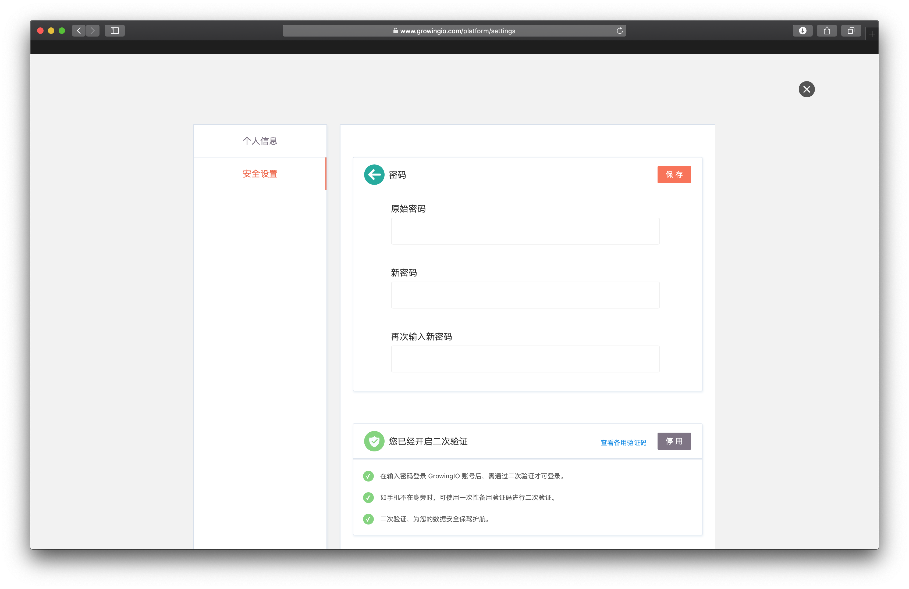

# 安全设置

## 修改登录密码

单击密码右侧的修改，输入原密码及新密码完成密码修改。

## 开启二次验证

二次验证是GrowingIO 为了保护企业账号的安全，在用户输入密码登录GrowingIO 后，仍需通过身份验证器、或者一次性备用验证码等对用户进行的第二次身份校验，只有通过第二次身份校验才能继续进行GrowingIO产品的操作。


开启二次验证后将极大提升您账号的安全性，重新登录时需要进行二次验证。


* **开启二次验证**：在未启用的情况下单击开启，按提示安装手机二次认证令牌管理软件（[Authenticator](https://support.google.com/accounts/answer/1066447?hl=zh-Hans)，[Authy](https://authy.com/features/setup/) 等）。
* **停用二次验证**：在已启用的情况下单击停用，输入登录密码验证后关闭二次验证。
* **查看备用验证码**：成功开启后会随机生成10个备用验证码，您可以下载到本地，以备手机不在身边时使用。每个备用验证码仅可使用一次，在验证码查看界面单击刷新，重新生成新的备用验证码。

