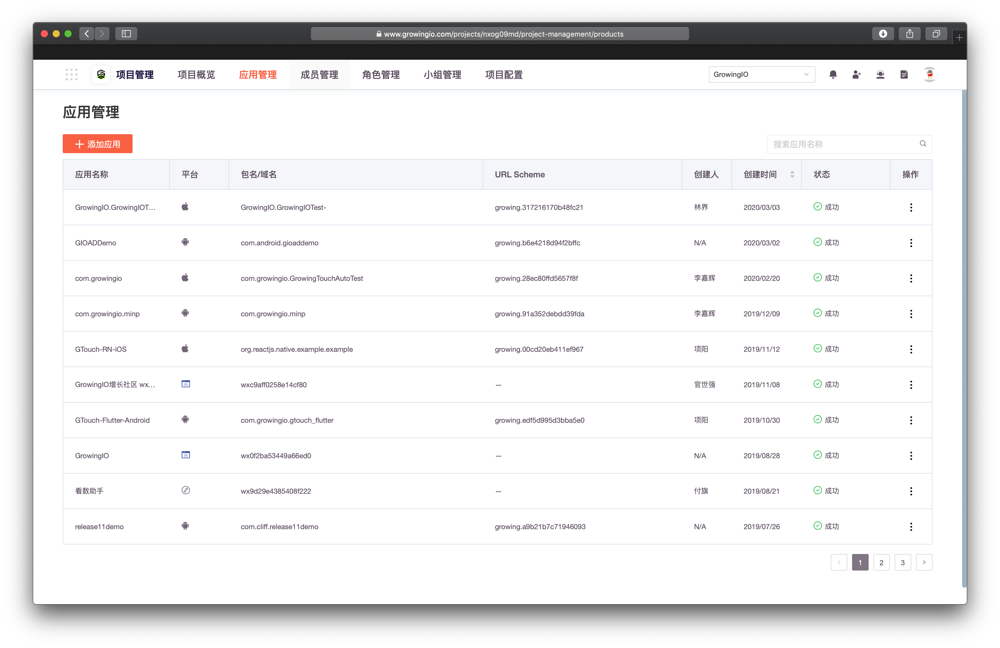
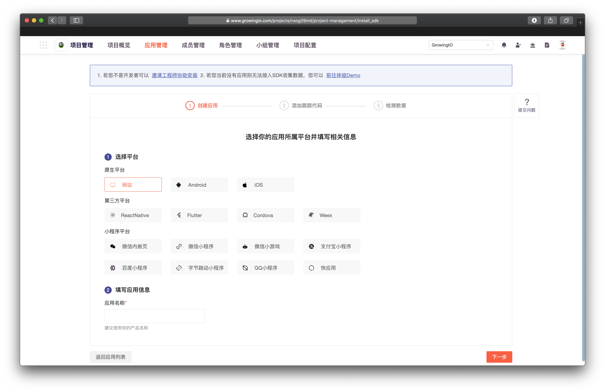
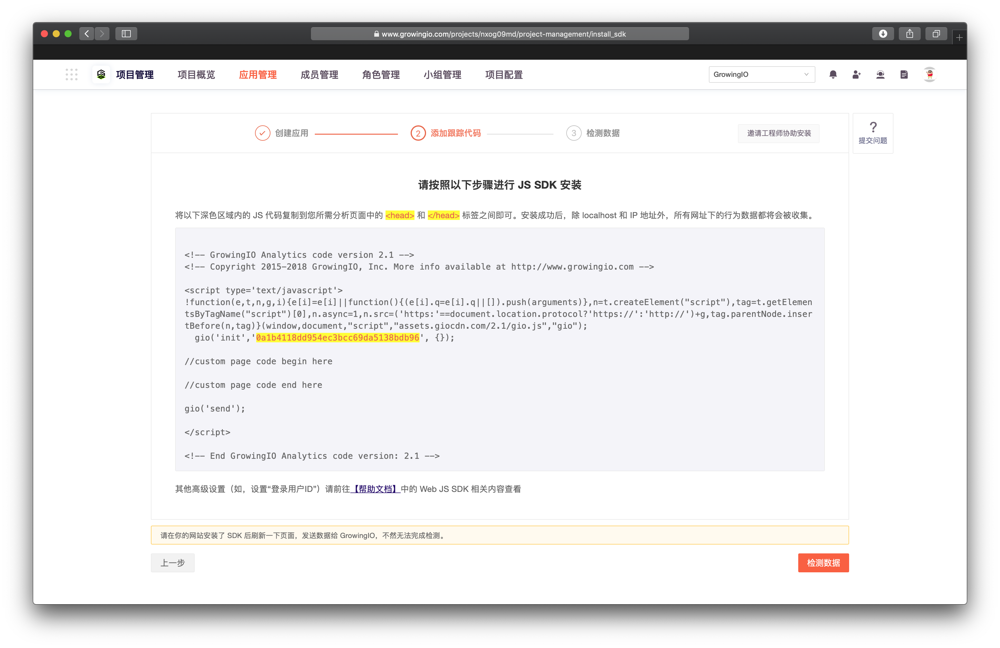
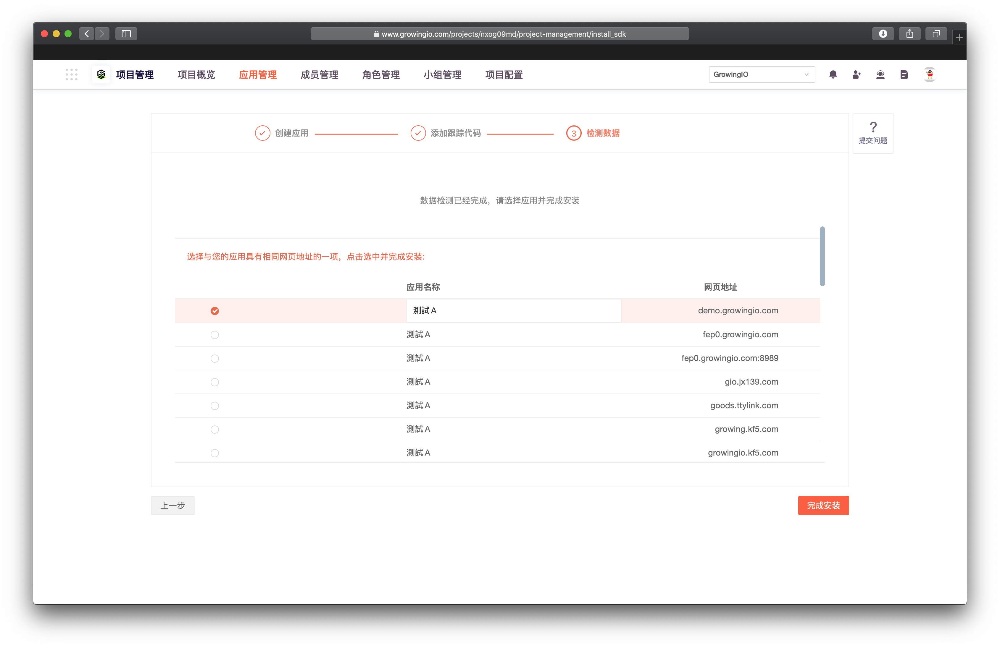
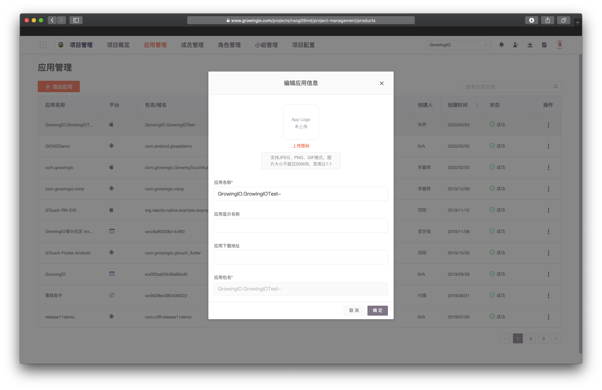
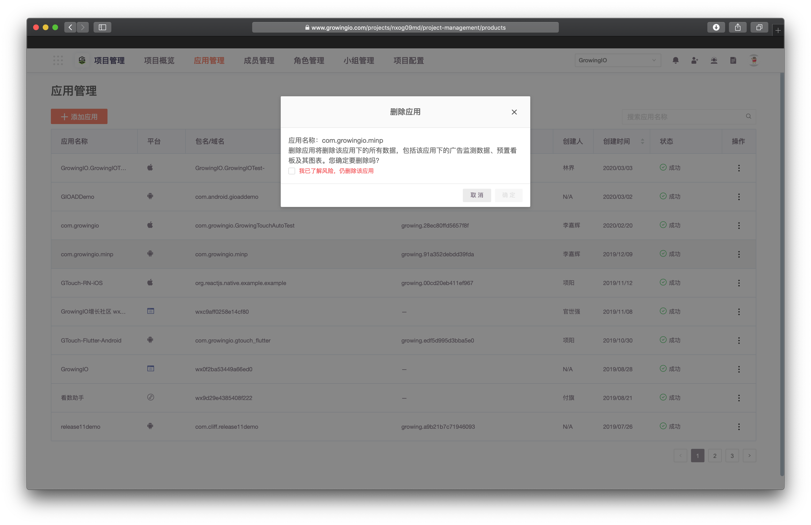

# 应用管理-done

## 概述

应用即区分不同软件行为数据存储的单元，一个应用对应一个已加载SDK的软件工程。

## 用途

应用管理可帮助管理 在此项目中集成的不同 应用，同时可新增应用加入该项目中一同进行数据分析，也可删除无用的应用

## 介面說明

选进入项目管理界面，选择顶部导航栏**应用管理**页签。

## 创建应用

1. 点击，添加应用 按钮，进入添加应用流程。


只需三部，GrowingIO SDK 接入，轻便、准确、简洁，帮助您快速接入，即刻启动数据增长。


   2.选择应用开发平台，输入应用名称 。_小程序需要需要输入小程序的唯一标识AppID。_


建议使用你的产品名称 ，有助于日后管理数据，也可以帮助同事更好的协作。


3.添加跟踪代码：请参考[SDK接入](../../kai-fa-zhe-wen-dang/sdkintegrated/)

4..检测数据：完成SDK接入后，单击检测数据，成功后生成应用。

## 修改应用

点击操作 -编辑应用信息

| 参数 | 说明 | 应用平台 |
| :--- | :--- | :--- |
| 上传图标 | 支持JPEG、PNG、GIF格式，图片大小不超过200KB，宽高比1：1。 | iOS、Android |
| 应用名称 | 修改GrowingIO平台上的应用名称。 | ALL |
| 应用显示名称 | 修改唤起应用时的应用名称。 | iOS、Android |
| 应用下载地址 | 填写应用的下载地址。 | iOS、Android |
| 应用包名、Web URL | 可查看、不支持修改。 | ALL |

## 删除应用

点击操作 -刪除应用


删除应用是一个极危险的操作

删除应用将删除该应用下的所有数据，包括该应用下的广告监测数据、预置看板及其图表。



如失误删除应用，请提交工单、或联系您的客户经理，GrowingIO 将尽快为你启动应急措施


