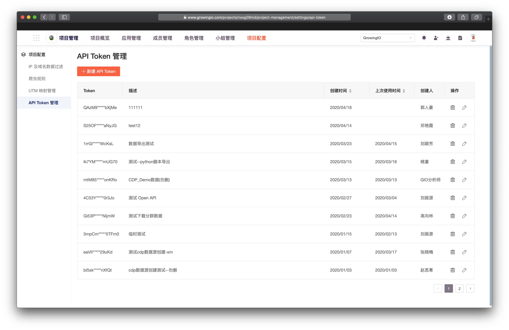
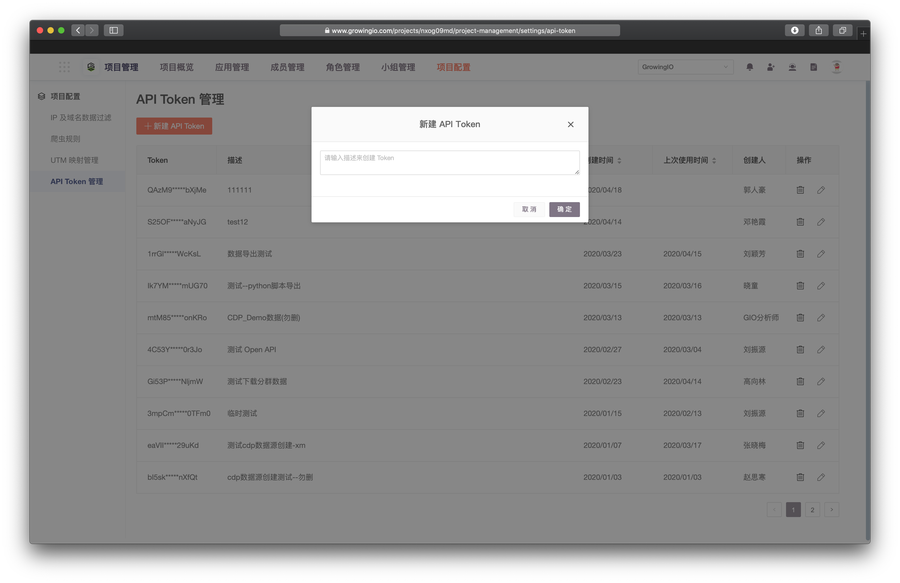
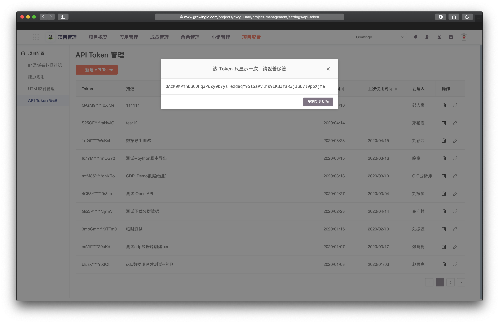

# API Token管理

API Token管理功能可直接由系统利用项目的公钥和私钥自动生成Token，省去了您频繁计算导致的错误、失效等问题。


为了您的数据安全，GrowingIO 即将禁止使用代码创建 Token，请您使用GrowingIO平台生成的 Token。


### 

一**. 进入页面：**选择项目配置，在项目配置界面选择**API token管理**页签。

二. **生成API Token :**  单击 新建API Token ，输入描述表明用途。

三. 复制Token界面关闭后不可再次查看，请您复制生成的token。


注意事项

* 生成的Token 只显示前 5 位字符 + \* + 最后 5 个字符 ，且不可查看原始值，如果忘记必须新建。
* 生成的Token永久生效，您可以手动删除使之失效。



提醒：

* 多个Token可同时供多个人使用，多个人也可同时使用同一个Token。
* 您可以创建多个Token分给不同的应用或人员使用。


### 管理Token

修改描述：单击  ，可修改当前Token的描述。

删除：单击  ，可以删除当前Token，删除后该Token即失效。

