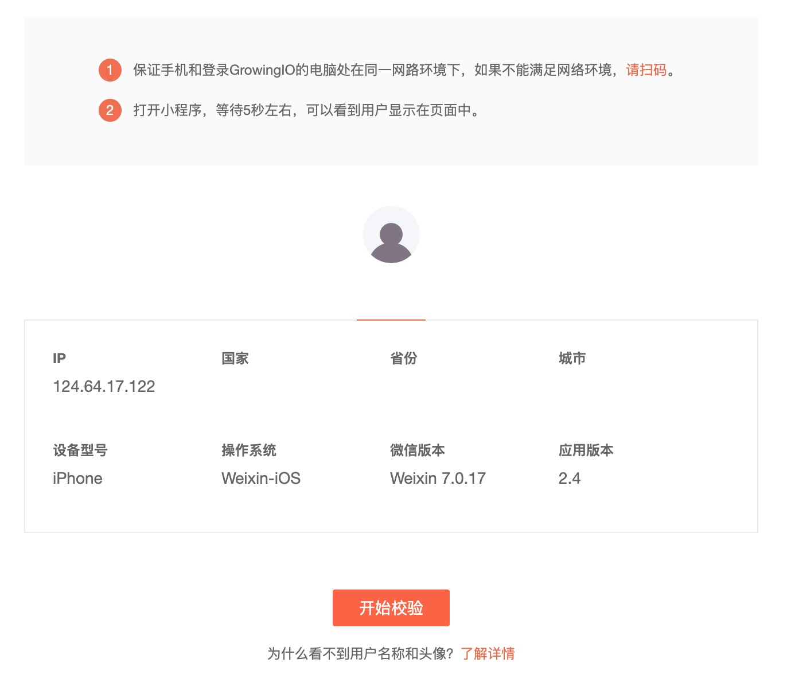
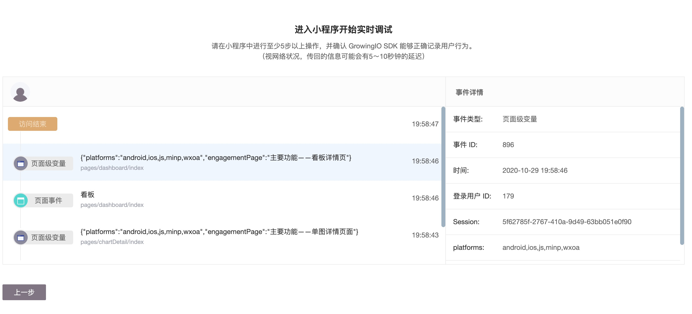

# 小程序&内嵌页Debugger

数据验证功能，可以支持用户根据自己的交互体验，实时看到GrowingIO采集的数据，完成数据收集的校验。

在完成SDK集成，点击“去检测”后，会跳转进入小程序/内嵌页Debugger的页面。

通过导航“数据管理-数据验证”，点击相应的应用后，会进入相应小程序/内嵌页的数据验证功能。

进入数据验证页面后：

1. 保证操作集成小程序/内嵌页应用SDK的手机和登录GrowingIO的电脑处在同一网路环境下。
2. 或者可以扫码，加入手机IP。
3. 打开微信，进入集成了小程序SDK的小程序或内嵌页SDK的内嵌页应用中。
4. 等待5秒左右，可以看到用户显示在页面中。

在功能页面上，会展示目前进入实时数据验证实时传输数据的微信应用用户，以及部分用户微信信息、设备、操作系统的信息。但是部分信息的展示，例如用户微信名称、头像、国家、省份、城市，需要在SDK中设置微信用户属性设置。详情请见[小程序SDK 微信用户属性设置](../sdkintegrated/mini-program-sdk/minp-sdk.md#2-wei-xin-yong-hu-xin-xi-de-pei-zhi)或者[微信内嵌页微信用户信息设置](../sdkintegrated/h5-sdk/#2-gao-ji-pei-zhi)。

选择自己的用户头像，点击“下一步”，进入用户行为记录页面。

和小程序/内嵌页产生交互（访问、页面浏览、点击等），以及上报的所有自定义埋点事件、变量、用户变量等，都在此页面可以看到数据实时上报的记录。

