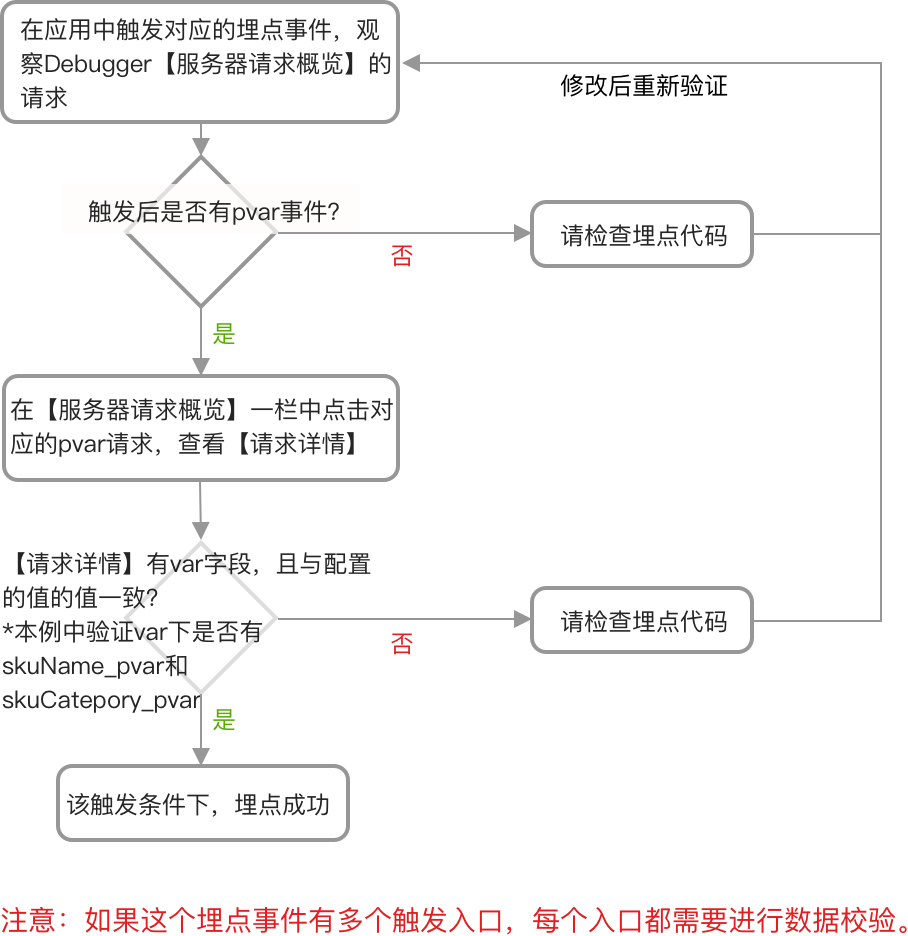

# 对 pvar（页面级变量）进行验证

> 场景：在商品详情页，设置“商品名称”、“商品品类”作为页面级变量。

**页面级变量配置方式示例**

| 标识符               | 名称   | 描述            |
| ----------------- | ---- | ------------- |
| skuName\_pvar     | 商品名称 | 商品名称          |
| skuCategory\_pvar | 商品品类 | 商品品类，例如裙子、鞋靴等 |

**对应的代码**

此示例中的页面级变量为“商品名称（skuName\_pvar）”、“商品品类（skuCategory\_pvar）”，在商品详情页面上设置了这两个页面级变量。

| 平台 | 原型 | 代码示例 |
| -- | -- | ---- |

| JS SDK | gio('page.set', key, value);或gio('page.set', pageLevelVariables); | gio('page.set', {'skuName\_pvar': '女士中跟凉鞋', 'skuCategory\_pvar': '鞋靴'}); |
| ------ | ----------------------------------------------------------------- | ------------------------------------------------------------------------ |

| Android SDK | 
GrowingIO.getInstance().setPageVariable(<code>Activity</code> activity, <code>String</code>key, <code>String</code> value);

或

GrowingIO.getInstance().setPageVariable(<code>Activity</code> activity, <code>JSONObject</code> pageLevelVariables);
 | 
JSONObject jsonObject = new JSONObject(); jsonObject.put("skuName_pvar", "女士中跟凉鞋"); jsonObject.put("skuCategory_pvar", "鞋靴");

GrowingIO.getInstance().setPageVariable(GoodsDetailActivity, jsonObject);
 |
| ----------- | --------------------------------------------------------------------------------------------------------------------------------------------------------------------------------------------------------------------------------------------------------------------- | -------------------------------------------------------------------------------------------------------------------------------------------------------------------------------------------------------------------- |

| iOS SDK | 
+ (void)setPageVariableWithKey:(NSString *)key andStringValue:(NSString *)stringValue toViewController:(UIViewController*)viewController;

或

+ (void)setPageVariable:(NSDictionary&#x3C;NSString *, NSObject *> *)variable toViewController: (UIViewController *)viewController;
 | \[Growing setPageVariable:@{@"skuName\_pvar":@"女士中跟凉鞋", @"skuCategory\_pvar":@"鞋靴"} toViewController:GoodsDetailViewController]; |
| ------- | -------------------------------------------------------------------------------------------------------------------------------------------------------------------------------------------------------------------------------------------------------------------------------------------------- | -------------------------------------------------------------------------------------------------------------------------------- |

在对应的应用（网站、Android 或者 iOS App）中打开设置了页面级变量的商品详情页，通过 Debugger 工具验证数据准确性

按照如下流程图验证

在本例中，如下图的数据请求说明打点代码生效

\*\*\*\*

\*\*\*\*

\*\*\*\*

\*\*\*\*
