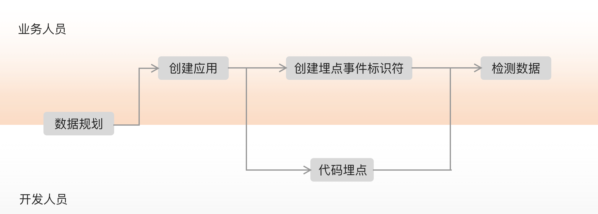

# SDK 使用流程

1. 数据规划（可选）：在无埋点采集的数据指标无法满足分析需求时需要定义业务目标&gt;拆分数据、规划场景&gt;确认指标。
2. 创建应用：通过在GrowingIO平台创建应用与您要加载SDK的应用进行关联。
3. 自定义数据上传（可选）：
   1. 业务端：[埋点事件管理](../../product-manual/data-center/data-management/manual.md)
   2. 代码端：各SDK集成章节的自定义数据上传。
4. 检测数据：在完成3后，在GrowingIO上单机检测数据完成应用创建。

