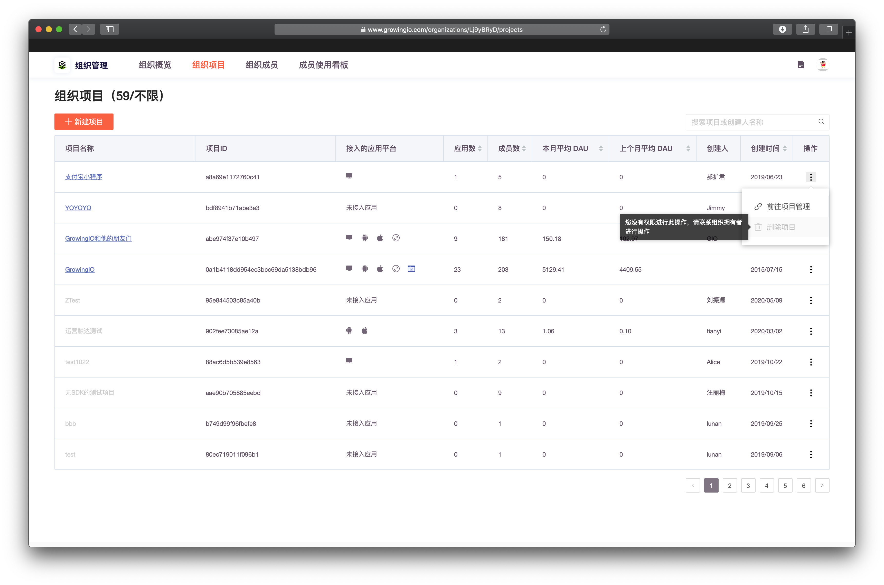

# 如何刪除不要的項目？


删除项目是高度危险的操作，为了保证数据安全。  
  
1.  需要操作者是【组织拥有者】【组织管理员】   
2. 需要操作者是  被删除项目的【项目超级管理员】

   
需要同时满足 两个条件。才可对该项目进行删除操作。


刪除项目位于 组织管理- 组织项目中 。

‌  
点击头像，进入组织概览 。

查看组织项目 &gt;  点击操作 &gt;  删除项目 ：

### 为何我身为组织拥有者，却无法删除组织下的项目 ？

由于 ，同组织下的多个项目，时常会常在跨部门、跨团队的情况 ，组织拥有者不一定是所有项目的负责人，为了避免您组织内的协作纠纷 ，因此做以下限制 ：


删除项目需要满足 两个条件。才可对该项目进行删除操作。

1.  需要操作者是【组织拥有者】【组织管理员】   
2. 需要操作者是  被删除项目的【项目超级管理员】


若需要经内部协调，需要删除自己无权限删除的项目，可联系GIO 客户经理，为您解决。

