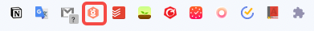

# Chrome插件安装步骤

### 插件下载[​](https://docs.growingio.com/op-help/docs/2.5/product-manual/data-management/auto-track/web/auto-track-web-chrome-plugin#%E6%8F%92%E4%BB%B6%E4%B8%8B%E8%BD%BD)

在 “**数据 > 事件 > 无埋点事件**" 中点击 “**创建无埋点事件 > 网页应用**“ 进入Web圈选说明页面。在页面中点击 “[**下载插件**](https://assets.giocdn.com/circle/collector/gio-saas-collection.zip)“ 下载 - GrowingIO SaaS Collection。

### **插件安装**[​](https://docs.growingio.com/op-help/docs/2.5/product-manual/data-management/auto-track/web/auto-track-web-chrome-plugin#%E6%8F%92%E4%BB%B6%E5%AE%89%E8%A3%85)

第一步: 打开Chrome浏览器后，在导航栏点击 “**窗口 > 扩展程序**“ 进入扩展程序管理页面。

第二步: 点击 “**加载已解压的扩展程序**“，打开插件解压目录，选择解压文件夹并完成插件安装。

.png>)

第三步: 在Chrome地址栏右侧点击 "**扩展程序**" 图标，选择插件将插件固定在导航栏，方便后续使用。

### 插件唤起 

第一步: 在谷歌浏览器地址栏中输入待圈选地址

第二步: 在扩展程序中选择GIO圈选插件

第三步: 输入GrowingIO账号、密码进行登陆

