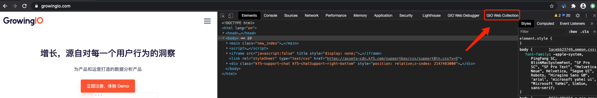
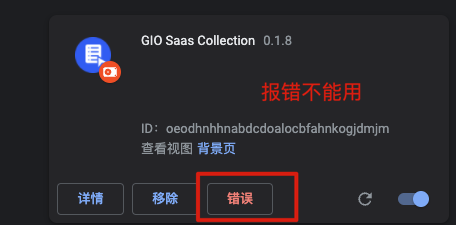

# Chrome插件安装步骤

### 插件下载[​](https://docs.growingio.com/op-help/docs/2.5/product-manual/data-management/auto-track/web/auto-track-web-chrome-plugin#%E6%8F%92%E4%BB%B6%E4%B8%8B%E8%BD%BD)

在 “**数据 > 事件 > 无埋点事件**" 中点击 “**创建无埋点事件 > 网页应用**“ 进入Web圈选说明页面。在页面中点击 “[**下载插件**](https://assets.giocdn.com/circle/collector/gio-saas-collection.zip)“ 下载 - GrowingIO Web Collection。

### **插件安装**[​](https://docs.growingio.com/op-help/docs/2.5/product-manual/data-management/auto-track/web/auto-track-web-chrome-plugin#%E6%8F%92%E4%BB%B6%E5%AE%89%E8%A3%85)

第一步: 打开Chrome浏览器后，在导航栏点击 “**窗口 > 扩展程序**“ 进入扩展程序管理页面。

第二步: 点击 “**加载已解压的扩展程序**“，打开插件解压目录，选择解压文件夹并完成插件安装。

.png>)

第三步: 在Chrome地址栏右侧点击 "**扩展程序**" 图标，选择插件将插件固定在导航栏，方便后续使用。

### 插件唤起 

第一步: 在Chrome中单击右键点击检查，或使用F12唤起检查模式。

第二步: 在检查模式中选择GIO SaaS Collection插件。

第三步: 输入GrowingIO账号、密码进行登陆

第四步: 建议设置检查模式在右侧边栏展示。

设置方法：Chrome检查模式右上角点击【三个竖立的点】选择展示形式，如下图：

.png>)

### **插件报错说明**

&#x20;当您安装成功插件后，会在Chrome扩展程序中看到错误提示，如下图：

点击错误按钮会展示如下信息，这种情况是由于Chrome扩展程序平台自身迭代过程所引发的报错，并不影响插件的正常使用。忽略即可。详见：[https://developer.chrome.com/blog/mv2-transition/](https://developer.chrome.com/blog/mv2-transition/)

.png>)

.png>)
