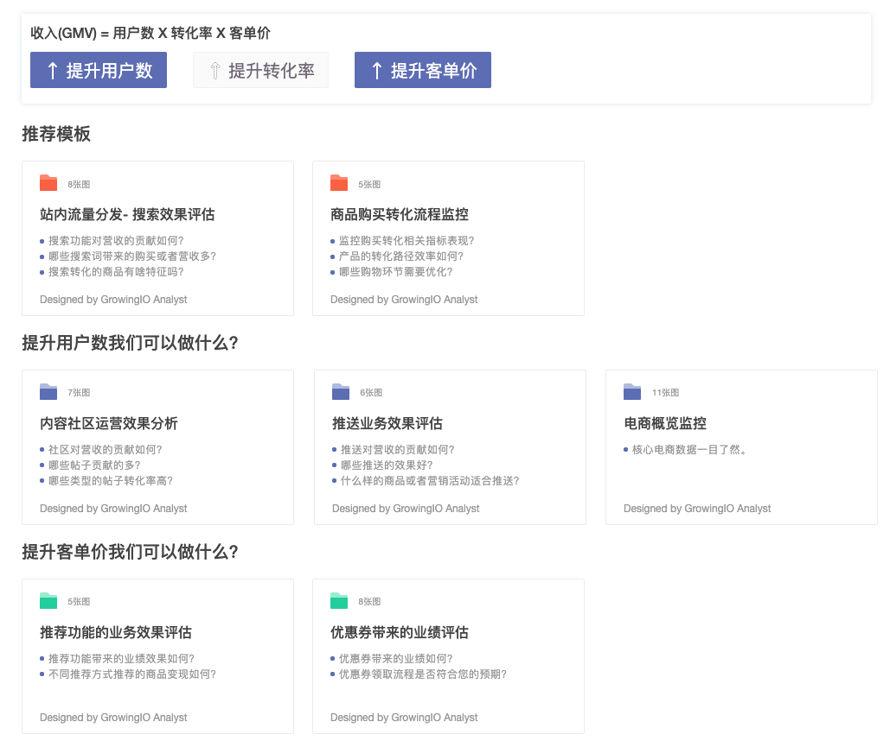
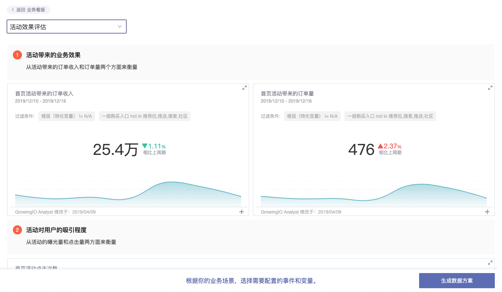

# 电商行业数据规划

## 操作步骤 

一. 顶部导航栏选择 **数据中心** > **数据规划**，单击**开始数据规划**，进入数据规划模块。

数据规划以模板的形式展示，模板分为三类：

| 看板模板  | 说明                                                                                        |
| ----- | ----------------------------------------------------------------------------------------- |
| 提升用户数 | 我们提供了3个看板模板：内容社区运营效果分析、推送业务效果评估、电商概览监控。                                                   |
| 提升转化率 | 我们提供了6个看板模板：活动效果评估、站内流量分发-首页、站内流量分发-搜索效果评估、站内流量转化归因-不停功能对业绩贡献分析、商品/品类业绩实时监控分析、商品购买转化流程监控。 |
| 提升客单价 | 我们提供了2个看板模板：推荐功能的业务效果评估、优惠券带来的业绩评评估。                                                      |

二. 单击您需要的看板，可查看看板模板中的数据展示。

三. 在看板模板详情内，单击右下角的生成数据方案，查看此方案中的事件和变量。

四. 单击确定生成方案，即可将此看版添加到您的首页自定义看板中，当前方案的事件和变量也会在数据管理中生成。

数据方案生成后，您需要在代码中上传数据方案中定义的事件和变量。
