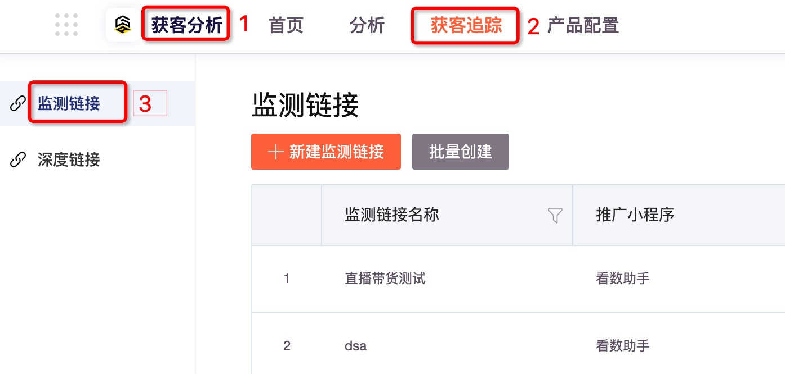
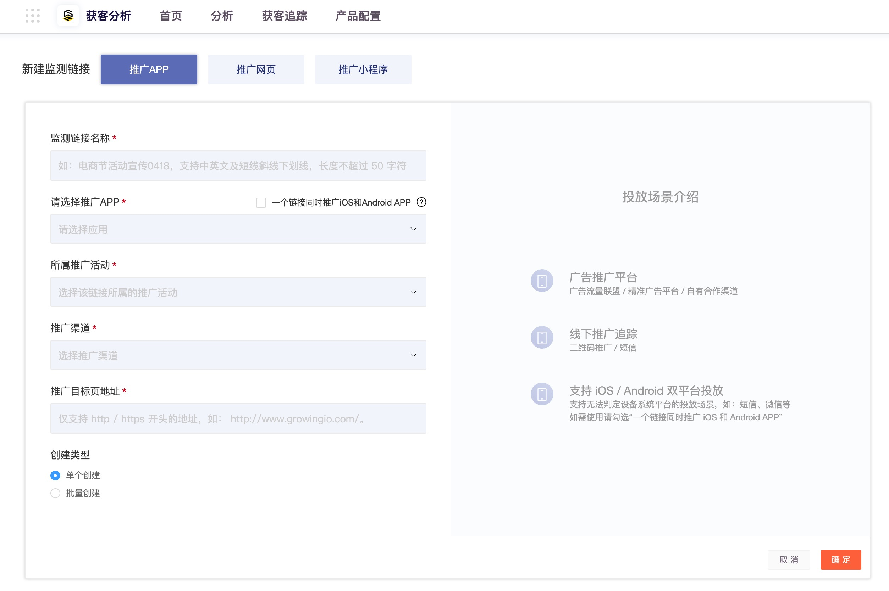
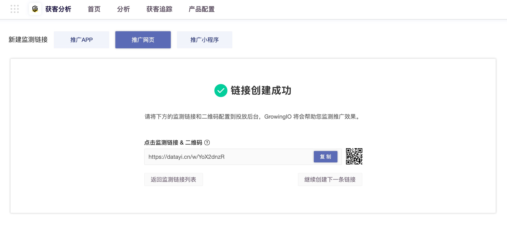

# 推广App

## 概述

适用于 App 下载拉新场景，对于常见的 App 下载行为追踪，可选择该方式创建链接来追踪用户 App下载行为，方便您衡量广告推广效果。

## SDK版本支持

如果您需要跟踪 App（ iOS & Android）由推广带来的 App 下载，可以使用此功能。使用之前请确保您的 App 中加载了GrowingIO 的 SDK1.0.3 及以上版本。

## 新建监测链接

 一. 在顶部导航栏选择“**获客分析 &gt; 获客追踪 &gt; 监测链接”**，进入监测链接列表。

二. 单击左上角的**新建监测链接**，进入新建监测链接页面。

三. 配置参数后单击确定，展示创建好的监测链接或二维码。

| 参数 | 说明 |
| :--- | :--- |
| 监测链接名称 | 监测链接名称，由中文、英文、短横线（-）、下划线（\_）、斜杠（/）组成，长度小于50个字符。 |
| 推广App | 选择您要推广的App，如果您需要在一条链接中同时推广您的 iOS 与 Android App，请勾选“一个链接同时推广iOS和Android App”。然后各自选择App。 |
| 推广活动 | 选择该链接所属的推广活动。 |
| 推广渠道 | 选择该链接所属的推广渠道。 |
| 推广目标页地址 | 根据实际活动推广情况，填入目标页URL地址。 |
| 创建类型 | 在一条链接推广一个平台App的情况下，支持批量创建。 |
| 批量创建数量 | 创建类型选择批量创建时可选，支持2-100之前的正整数。 |

\*\*\*\*

## 

