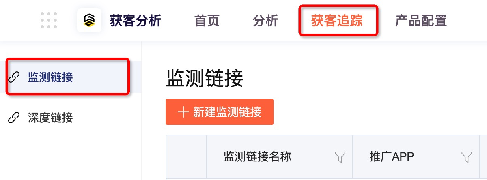
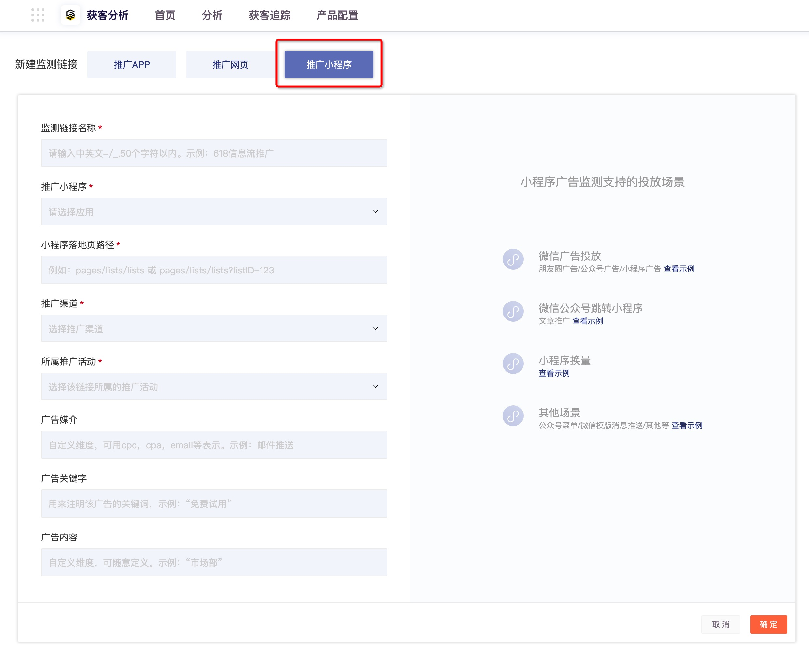

# 推广小程序（微信）

## 场景介绍

在您的微信小程序推广中，常见的几个付费/渠道推广的方式有：

1.微信公众号图文中插入小程序推广，例如以下形式：

1. 微信广告中推广，其中包括朋友圈广告、公众号广告、小程序广告等，呈现方式如下：

1. 部分小程序直接跳转换量等。

GrowingIO的小程序推广广告链接，可以支持如上的投放形式。

## 创建监测链接 

一. 在顶部导航栏选择“**获客分析 &gt; 获客追踪 &gt; 监测链接”**，进入监测链接管理模块。

二. 单击左上角的**新建监测链接**，选择推广小程序。

| 参数 | 说明 |
| :--- | :--- |

| 监测链接名称 | 监测链接名称，由中文、英文、短横线（-）、下划线（\_）、斜杠（/）组成，长度小于50个字符。 |
| :--- | :--- |

| 推广小程序 | 选择要推广的小程序。 |
| :--- | :--- |

<table>
  <thead>
    <tr>
      <th style="text-align:left">&#x5C0F;&#x7A0B;&#x5E8F;&#x843D;&#x5730;&#x9875;&#x8DEF;&#x5F84;</th>
      <th
      style="text-align:left">
        
&#x5F85;&#x63A8;&#x5E7F;&#x5C0F;&#x7A0B;&#x5E8F;&#x7684;&#x843D;&#x5730;&#x9875;&#x94FE;&#x63A5;&#x3002;

        
&#x70B9;&#x51FB;&#x843D;&#x5730;&#x9875;&#x8DEF;&#x5F84;&#xFF0C;&#x5C55;&#x793A;&#x7684;&#x662F;&#x5BF9;&#x5E94;&#x7684;&#x5C0F;&#x7A0B;&#x5E8F;&#x7684;&#x524D;&#x51E0;&#x4E2A;&#x8BBF;&#x95EE;&#x91CF;&#x7684;&#x9875;&#x9762;&#xFF1B;&#x5982;&#x679C;&#x9700;&#x8981;&#x63A8;&#x5E7F;&#x7684;&#x843D;&#x5730;&#x9875;&#x4E0D;&#x5728;&#x5217;&#x8868;&#x4E2D;&#xFF0C;&#x53EF;&#x4EE5;&#x76F4;&#x63A5;&#x586B;&#x5199;&#x8DEF;&#x5F84;&#x5730;&#x5740;&#x5373;&#x53EF;&#x3002;

        </th>
    </tr>
  </thead>
  <tbody></tbody>
</table><table>
  <thead>
    <tr>
      <th style="text-align:left">&#x63A8;&#x5E7F;&#x6E20;&#x9053;</th>
      <th style="text-align:left">
        
&#x9009;&#x62E9;&#x8BE5;&#x94FE;&#x63A5;&#x6240;&#x5C5E;&#x7684;&#x63A8;&#x5E7F;&#x6E20;&#x9053;&#x3002;&#x5EFA;&#x8BAE;&#x586B;&#x5199;&#x201C;&#x5FAE;&#x4FE1;&#x516C;&#x4F17;&#x53F7;&#x6587;&#x7AE0;&#x201D;&#x3002;

        
&#x4E0B;&#x62C9;&#x6846;&#x663E;&#x793A;&#x5DF2;&#x521B;&#x5EFA;&#x7684;&#x63A8;&#x5E7F;&#x6E20;&#x9053;&#xFF0C;&#x7CFB;&#x7EDF;&#x4E2D;&#x9884;&#x7F6E;&#x4E86;&#x51E0;&#x4E2A;&#x63A8;&#x5E7F;&#x6E20;&#x9053;&#xFF0C;&#x5982;&#x679C;&#x4E0D;&#x6EE1;&#x8DB3;&#x9700;&#x6C42;&#xFF0C;&#x70B9;&#x51FB;&#x300C;&#x65B0;&#x5EFA;&#x6E20;&#x9053;&#x300D;&#x521B;&#x5EFA;&#x5373;&#x53EF;&#x3002;

      </th>
    </tr>
  </thead>
  <tbody></tbody>
</table><table>
  <thead>
    <tr>
      <th style="text-align:left">&#x63A8;&#x5E7F;&#x6D3B;&#x52A8;</th>
      <th style="text-align:left">
        
&#x9009;&#x62E9;&#x8BE5;&#x94FE;&#x63A5;&#x6240;&#x5C5E;&#x7684;&#x63A8;&#x5E7F;&#x6D3B;&#x52A8;&#x3002;&#x5982;&#x679C;&#x662F;&#x65E5;&#x5E38;&#x63A8;&#x6587;&#xFF0C;&#x5EFA;&#x8BAE;&#x586B;&#x5199;&#x201C;<em><b>&#x516C;&#x4F17;&#x53F7;&#x63A8;&#x6587;</b></em>&#x201D;&#xFF1B;&#x5982;&#x679C;&#x662F;&#x6709;&#x7279;&#x522B;&#x7684;&#x63A8;&#x5E7F;&#x6D3B;&#x52A8;&#xFF0C;&#x4F8B;&#x5982;&#x201C;<b>315&#x63A8;&#x5E7F;&#x6D3B;&#x52A8;</b>&#x201D;&#xFF0C;&#x5C31;&#x586B;&#x5199;&#x63A8;&#x5E7F;&#x6D3B;&#x52A8;&#x7684;&#x540D;&#x79F0;&#x3002;

        
&#x4E0B;&#x62C9;&#x6846;&#x663E;&#x793A;&#x5DF2;&#x521B;&#x5EFA;&#x7684;&#x63A8;&#x5E7F;&#x6D3B;&#x52A8;&#xFF0C;&#x5982;&#x679C;&#x4E0D;&#x6EE1;&#x8DB3;&#xFF0C;&#x5355;&#x51FB;&#x300C;&#x65B0;&#x5EFA;&#x6D3B;&#x52A8;&#x300D;&#x521B;&#x5EFA;&#x5373;&#x53EF;&#x3002;

      </th>
    </tr>
  </thead>
  <tbody></tbody>
</table>| 广告媒介 | 按照投放广告的计算方式，建议填写“_**公众号推文**_” |
| :--- | :--- |

| 广告关键字 | 可以根据公众号推广文章的内容提炼，例如_“**明星推荐良心品牌**”_ |
| :--- | :--- |

| 广告内容 | 建议填写公众号推广文章的标题，例如“_**315你要知道的良心品牌产品**_” |
| :--- | :--- |

