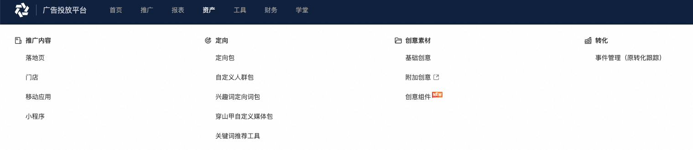
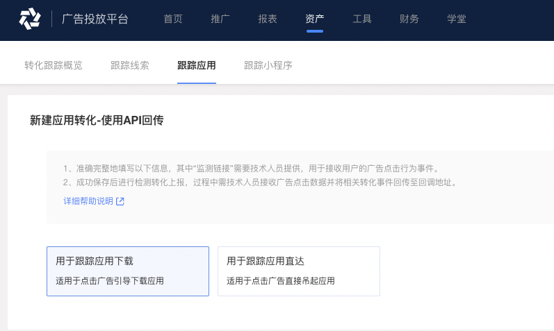
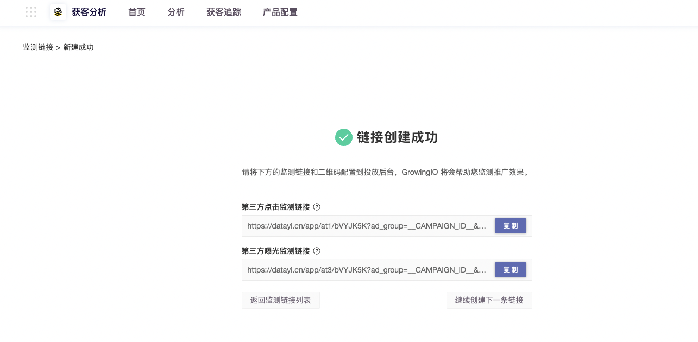

# 今日头条（巨量纵横）

1、进入头条广告投放平台（巨量纵横），在“资产”中找到“转化”，点击事件管理。

点击跟踪应用，进入新建应用转化—使用API回传创建应用转化跟踪页面。

2、选择“用于跟踪应用下载”，并填写应用下载地址，iOS 应用请填写 APP 的 iTunes 下载地址，Android 应用请填写投放 APP 对应的下载地址。

3、在 GIO 中创建广告监测，推广渠道选择【今日头条】，创建监测链接。

.png>)

4、将 GIO 生成的监测链接填写至头条“点击监测链接”当中，如果需要监测广告曝光数据，请一并填写“展示监测链接”。

5、监测链接配置完后，请按照今日头条联调流程进行调试，联调成功后即可开启正式投放。
