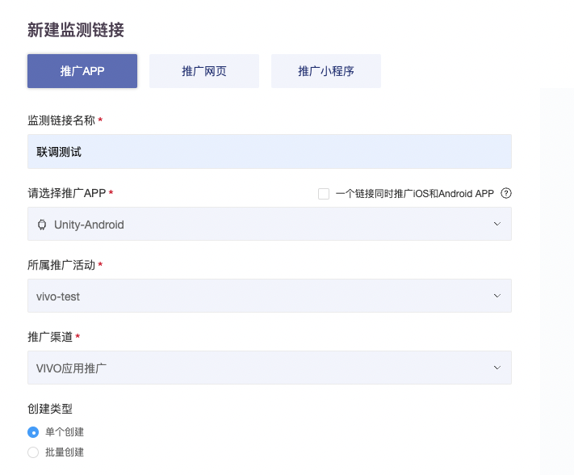
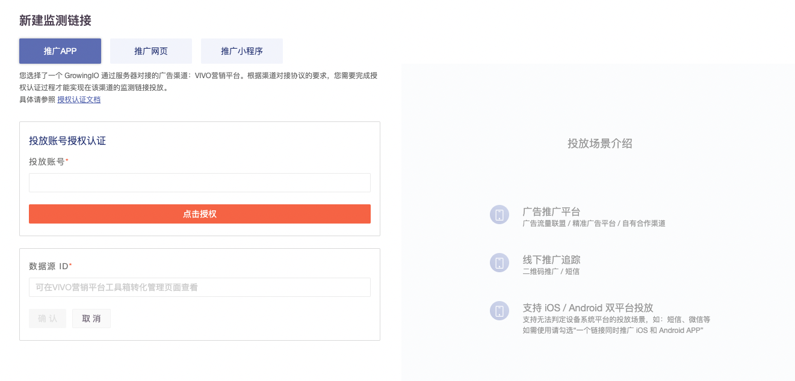
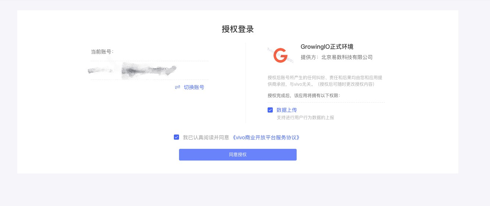
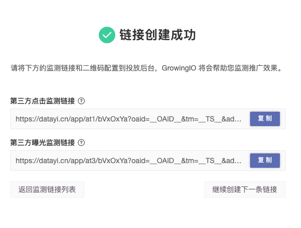
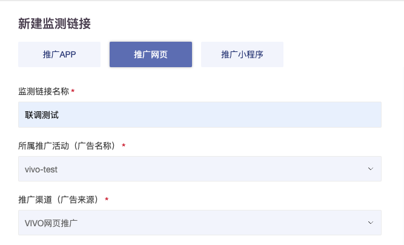
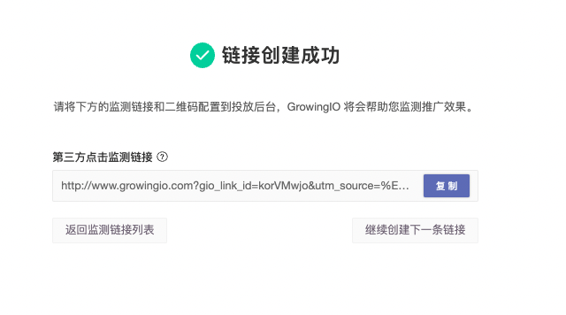

# VIVO营销平台

1、VIVO营销平台在投放时会根据应用类型做区分，广告主需根据自身投放情况创建对应的数据源，并进行转化管理配置，VIVO营销平台地址为：https://ad.vivo.com.cn/home，登录后具体路径如下：

工具箱→转化管理（如未开通请与VIVO营销平台人员联系申请）

.png>)

&#x20;创建成功后在GrowingIO后台进行授权并创建对应的监测链接之后即可通过API对投放数据进行分析。 &#x20;

2、推广APP路径：

&#x20;    登录GIO增长平台→获客分析→获客追踪→监测链接→新建监测链接→推广APP：

&#x20;    推广渠道请选择：【VIVO应用推广】

点击确定后会跳转至授权页面，如下：

其中投放账号需手动填写，对应值为VIVO营销后台的账户名（中文），点击授权后跳转至如下页面：

完成授权返回GIO后台请继续填写对应的数据源ID（可在VIVO营销平台工具箱转化管理页面查看）

点击确认后生成对应的曝光监测链接和点击监测链接，将链接填入VIVO营销平台对应投放页面即可

3、推广网页路径：

&#x20;    登录GIO增长平台→获客分析→获客追踪→监测链接→新建监测链接→推广网页：

&#x20;    推广渠道请选择：【VIVO网页推广】

授权逻辑及交互同上，填写正确的数据源ID点击完成，生成对应的落地页监测链接。将监测链接填入VIVO营销平台对应投放页面即可。

&#x20;

