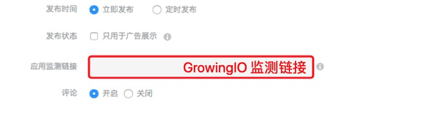

# 微博超级粉丝通

1.联系微博广告运营对接人员，确认自己的 company 信息。

2.在 GrowingIO 后台选择【超级粉丝通】渠道，填入 company 创建监测链接。

3.在微博超级粉丝通工具箱入口中找到应用激活监控申请入口。

4.开始进行联调，在新建监控中将 company 、监测链接、联调设备信息对应填入。

5.开始进行联调，第一步，请在测试设备中下载激活 App，必须确认与上方填写的一致，第二步，安装并打开 App ，稍后激活数据将由 GrowingIO 发送至微博服务器（2-3 分钟左右），请一定确认激活已经回传后，再点击【查看激活】按钮获取数据，否则会一直显示失败。

6.收到激活成功提示后，可关闭该联调界面

7.在超级粉丝通后台中新建广告创意页面中填写监测链接，监测激活数据。

注意：关于 Android 设备联调，因为微博渠道使用 IMEI 作为设备标识进行回传匹配，由于当前 Android 10 系统中已经不支持 IMEI 信息采集，在联调时请选择系统版本在 Android 10 以下的设备进行联调测试。

