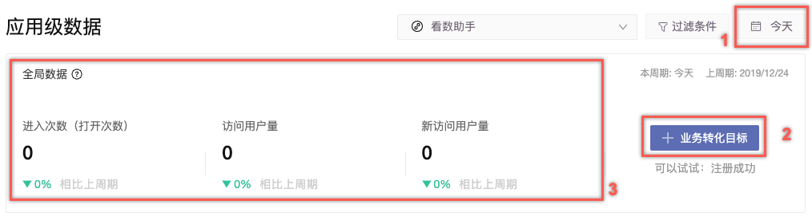

# 应用级数据

推广数据根据应用的不同分为：App应用推广数据、网页应用推广数据、微信小程序推广数据。

## App 应用推广数据

### 数据指标概念

* 激活：激活是指 App下载后首次联网打开 SDK 会上报一条该设备的激活数据，该指标可理解为 App 的下载安装量。
* 激活总量：通过 SDK 上报至 GrowingIO 的全部激活设备总量。
* 推广激活：通过监测链接监测到发生激活的设备。
* 推广新激活：推广激活设备的排重后数量，对同一设备在时间周期内（30天）反复激活仅记一次。

### 全局设定

| 项 | 说明 |
| - | -- |

| 时间 | 可通过时间控件设定当前报表数据统计时间段，时间范围设定后将应用在报表全局。（上图位置 1 所示） |
| -- | ------------------------------------------------ |

| 添加业务转化目标 | 可以添加您关注的业务转化指标，该业务指标在下方图表中将作为基本的分析数据指标。（上图位置 2 所示 ） |
| -------- | --------------------------------------------------- |

| 全局数据 | 
展示当前移动端广告投放环节的基本监控指标数据。（上图位置 3 所示 ）

周期对比：根据当前选择的时段，计算周期对比，当前为周对比，并提供说明本周期与上周期时间计算区间。

全局数据中各指标间数据无发生先后顺序逻辑关联，各指标数据为单指标独立统计的加和数据。
 |
| ---- | -------------------------------------------------------------------------------------------------------------------------------------------------- |

展示当前 App 下的激活数据，以线图方式展示数据变化情况，结合右侧提供圆环图，可快速了解当前推广激活占整体激活的比例，以及推广新激活在推广激活中的占比分布，方便衡量活动推广效率及活动推广质量。

此图表支持数据导出，通过右上角下载按钮即可导出当前表格数据。

### 广告活动和渠道效果分析

以线图、柱图的方式展示当前选择的时段下，广告活动和广告渠道的数据情况，并在图表右侧提供简单洞察，可快速发现执行效果最优的广告活动以及广告渠道。

### 推广日报

推广日报可查看各链接级别的详细统计数据，上方数据图表中的数据逻辑与该推广日报统计逻辑一致。

支持按统计字段聚合展示数据，支持的字段包括：时间、推广活动、目标渠道、监测链接。

支持自定义表格列数据，通过自定义指标按钮可自定义需要展示的指标。

此报表支持数据导出，通过右上角下载按钮即可导出当前表格数据。

### 推广详细

推广详细展示的数据会以监测链接在点击阶段收到数据进行归因，后续转化阶段数据皆会向本次点击归因，数据统计按照点击发生环节统计，此方式方便衡量各链接推广效率。

支持按字段聚合展示数据，支持的字段包括：时间、推广活动、目标渠道、监测链接。

支持自定义表格列数据，通过自定义指标按钮可自定义需要展示的指标。

此报表支持数据导出，通过右上角下载按钮即可导出当前表格数据。

## 网页应用推广数据

### 数据指标概念

* 点击：GrowingIO 监测链接的点击数统计。
* 进入量：访问用户进入网站进行访问的数量。
* 访问用户量：访问用户的数量。
* 新访问用户量：过去 365 天内首次访问用户的数量。

### **全局设定**

| **项** | 说明 |
| ----- | -- |

| 时间 | 
可通过时间控件设定当前报表数据统计时间段，时间范围设定后将应用在报表全局。（上图位置 1 所示）

&#x3C;b>&#x3C;/b>
 |
| -- | ------------------------------------------------------------------------------- |

| 业务转化目标 | 可以添加您关注的业务转化指标，该业务指标在下方图表中将作为基本的分析数据指标。（上图位置 2 所示 ） |
| ------ | --------------------------------------------------- |

| 全局数据 | 
展示当前 Web 端广告投放环节的基本监控指标数据。（上图位置 3 所示 ）

周期对比：根据当前选择的时段，计算周期对比，当前为周对比，并提供说明本周期与上周期时间计算区间。

全局数据中各指标间数据无发生先后顺序逻辑关联，各指标数据为单指标独立统计的加和数据。
 |
| ---- | ----------------------------------------------------------------------------------------------------------------------------------------------------- |

以线图、柱图的方式展示当前选择的时段下，广告活动和广告渠道的数据情况，并在图表右侧提供简单洞察，可快速发现执行效果最优的广告活动以及广告渠道。

### 活动效果对比

| 项         | 说明                                                                           |
| --------- | ---------------------------------------------------------------------------- |
| 访问用户量/点击量 | 在活动效果对比中，可直接结合用户行为数据，对比不同活动间的转化效果，使用折线图来比较广告活动访问用户量、广告活动点击数据，分析对比两个活动间的同期效果。 |
| 转化漏斗      | 以转化漏斗形式展示从广告活动点击到目标页访问（落地页），再到设定的转化目标，各环节的转化情况，对比不同活动间的转化效率。                 |
| 访问人数渠道贡献  | 展示在到达目标页面的访问人数中，不同渠道的访问人数占比，对比各渠道的投放效果。                                      |

### 报表详情数据

**推广详情**

推广详细可查看各链接级别的详细统计数据，上方数据图表中展示的数据依照该推广日报。

支持按字段聚合展示数据，支持的字段包括：时间、推广活动、目标渠道、监测链接**。**

此报表支持数据导出，通过右上角下载按钮即可导出当前表格数据。

## 微信小程序推广数据

### 数据指标概念

* 进入次数（打开次数）：访问用户进入应用进行访问的数量。
* 访问用户量：访问用户的数量。
* 新访问用户量：过去365天内首次访问的用户数量。

### 全局设定

| **项** | 说明 |
| ----- | -- |

| 时间 | 
可通过时间控件设定当前报表数据统计时间段，时间范围设定后将应用在报表全局。（上图位置 1 所示）

&#x3C;b>&#x3C;/b>
 |
| -- | ------------------------------------------------------------------------------- |

| 业务转化目标 | 可以添加您关注的业务转化指标，该业务指标在下方图表中将作为基本的分析数据指标。（上图位置 2 所示 ） |
| ------ | --------------------------------------------------- |

| 全局数据 | 
展示当前 Web 端广告投放环节的基本监控指标数据。（上图位置 3 所示 ）

周期对比：根据当前选择的时段，计算周期对比，当前为周对比，并提供说明本周期与上周期时间计算区间。

全局数据中各指标间数据无发生先后顺序逻辑关联，各指标数据为单指标独立统计的加和数据。
 |
| ---- | ----------------------------------------------------------------------------------------------------------------------------------------------------- |

以线图、柱图的方式展示当前选择的时段下，广告活动和广告渠道的数据情况，并在图表右侧提供简单洞察，可快速发现执行效果最优的广告活动以及广告渠道。
