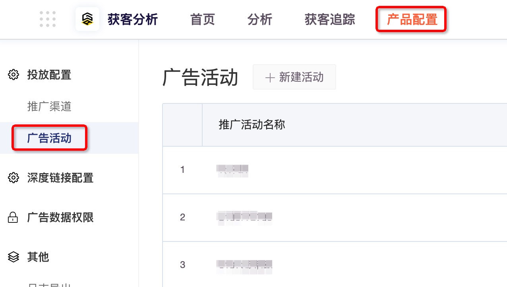
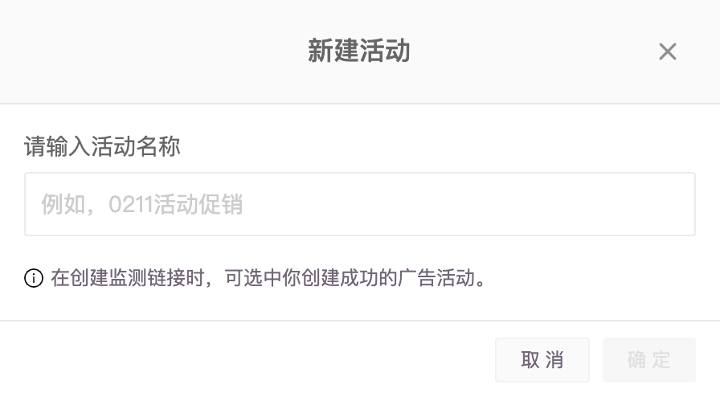

# 广告活动管理

在广告监测下创建的监测链接时创建的活动都会在此统一管理，您也可以在此处直接创建好活动，在创建链接的时候直接选取；利用搜索功能快速查找您的活动。

在顶部导航栏选择“**获客分析 > 产品配置 > 广告活动 ”**，进入广告活动管理页面。

**创建活动**：单击页面上方的新建活动，输入活动名称后单击确定。

**删除活动**：单击单条活动右侧的  删除不需要的、未被监测链接使用的活动。


**删除提示**

如果活动被监测链接使用，需先删除监测链接才能删除此活动。

