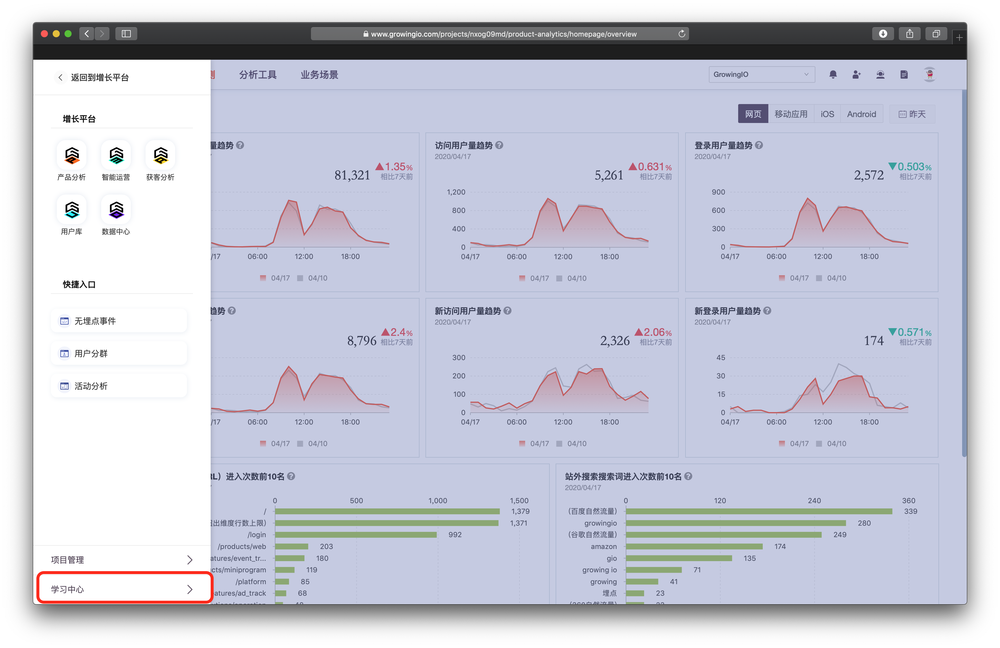
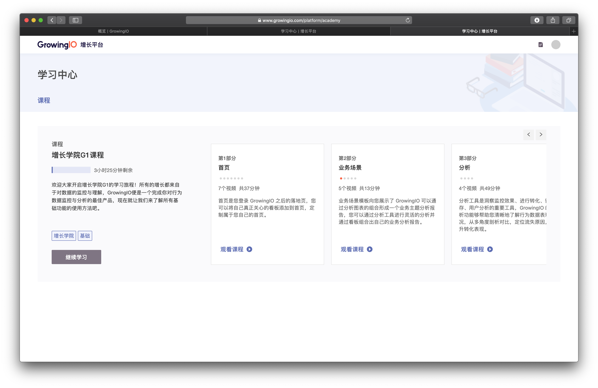

# 学习中心

GrowingIO 为您设计了基础功能的使用方法学习课程，您可以在此处进行阶段性的学习与回顾。



除此之外 ，GrowingIO 最为国内增长方法的实践者，也为您提供大量的 公开课、实践案例、行业分享，‌  
点此查看[GrowingIO 在线学堂 ](https://www.growingio.com/school)，接受行业前沿增长知识。

## 如何进入学习中心

1.点击，顶部导航栏  九宫格 按钮 。

2. 打开 GrowingIO 应用切换匡 ， 点击-学习中心

3. 进入学习中心


直接透过链接行问  &gt;&gt; [https://www.growingio.com/platform/academy](https://www.growingio.com/platform/academy)


