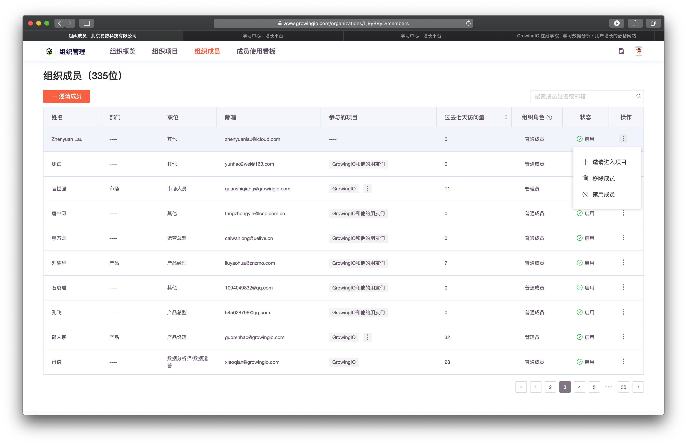
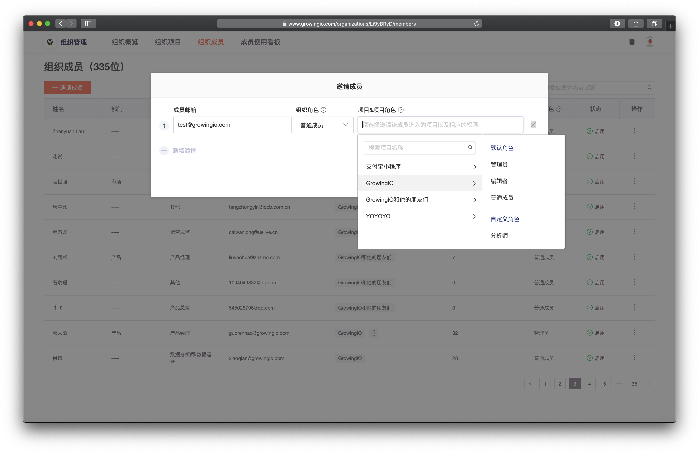
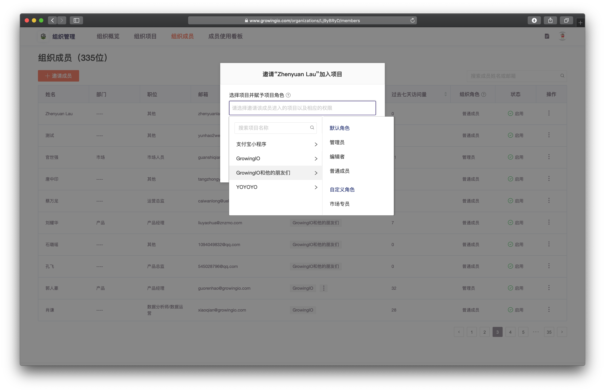

# 组织成员-done

进入组织管理界面，选择 **组织成员** 页签。·

## 邀请成员

1. 单击 **邀请成员**，打开 **邀请成员** 页面。
2. 填写一个或多个带邀请用户的邮箱，选择组织角色、所属项目、项目角色后，单击**邀请**。
3. 被邀请人将收到邀请邮件。

## 邀请成员至项目

1. 点击，操作- 邀请成员至项目

2. 选择该成员要加入的项目，以及项目角色
3. 单击**邀请**。被邀请人将收到邀请邮件。

## 调整成员组织角色


仅组织拥有者可调整其他组织成员组织角色


组织角色的主要功能在与决定该成员在组织管理，拥有哪些权限 

组织拥有者： 拥有所有操作权限。

组织管理员：可以进行除修改组织名称、更换组织拥有者之外的所有组织管理操作权限。 

组织普通成员：不可以进行组织管理。


组织拥有者能将组织管理员角色分配给组织成员。

在组织成员列表页面，单击待调整成员右侧的组织角色，可以修改变更组织角色


## 禁用/启用

1. 选中成员列表中的某个成员。
2. 选中操作 禁用/启用。


**1.**组织拥有者和组织管理员可以禁用、启用、移除组织内成员

2.禁用后该成员仍会保留在组织内，但将无法访问组织内的任一项目。


## 移除成员

1. 选中成员列表中的某个成员
2. 点击操作 - 移除成员


移除后该成员将无法进入本组织内的任一项目，且与组织内部所有项目的关联关系都将会被解除，无法恢复。


