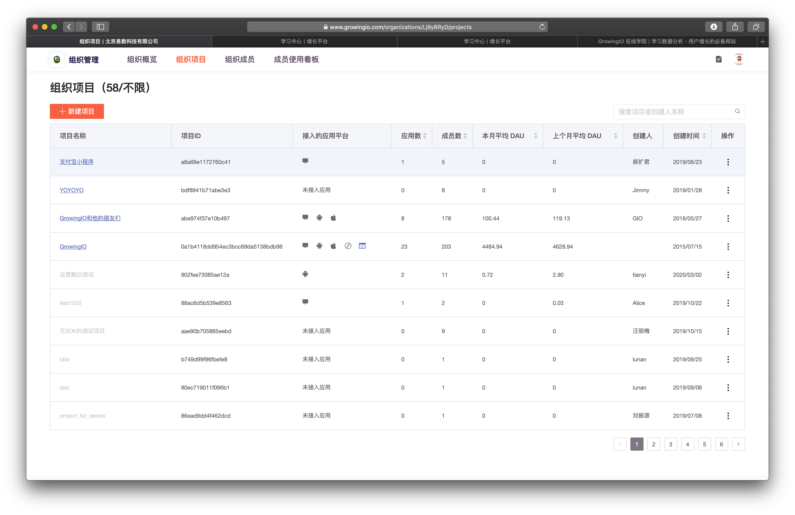

# 组织项目

## 用途

组织拥有者和组织管理员可以为组织创建多个项目，您可以在组织项目列表处管理组织下的项目。


一个组织中的项目数项上限，依据购买版本所决定。

什么是项目？ [点击查看](https://app.gitbook.com/@growingio/s/v3/~/drafts/-MBcwXbYNkFvkWTAXo-d/product-manual/projectmange)


## 界面说明

1.点击头像下方 &gt; 组织概览 ，进入组织管理界面，。

2.选择顶部导航栏 **组织项目** 页签

## 新建项目

单击**新建项目**，填写项目名称后单击 **保存**。


一个项目下可以创建多个应用，Web端对应不同的域名，移动端对用不同的平台或包名，小程序则对应不同的App ID。一个项目下的多个应用数据会被合并统计，并在概览中通过平台、App ID的方式区分。



项目数量依据商务签约版本进行额度的约定，如需增购，请联系客户经理


## 删除项目

单击需要删除项目右侧的  **操作** 选择 **删除项目**，通过身份验证后单击**删除**。


删除项目是高度危险的操作，为了保证数据安全。  
  
1.  需要操作者是【组织拥有者】【组织管理员】   
2. 需要操作者是  被删除项目的【项目超级管理员】

   
需要同时满足 两个条件。才可对该项目进行删除操作。



删除项目后，数据将无法恢复，项目内成员将被从项目中移除。


## 常见问题：

### 为何我身为组织拥有者，却无法删除组织下的项目 ？

由于 ，同组织下的多个项目，时常会常在跨部门、跨团队的情况 ，组织拥有者不一定是所有项目的负责人，为了避免您组织内的协作纠纷 ，因此做以下限制 ：


删除项目需要满足 两个条件。才可对该项目进行删除操作。

1.  需要操作者是【组织拥有者】【组织管理员】   
2. 需要操作者是  被删除项目的【项目超级管理员】


若需要经内部协调，需要删除自己无权限删除的项目，可联系GIO 客户经理，为您解决。

