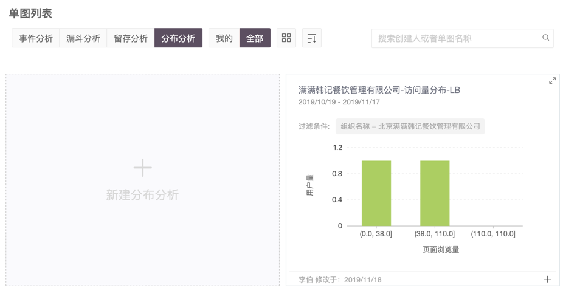
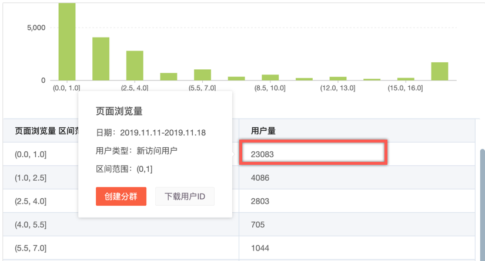

# 创建分布分析

## 操作步骤

一. 在顶部导航栏选择“**产品分析 &gt; 分布分析”**，进入单图列表的分布分析模块。

二. 单击**新建分布分析**，进入**新建分布分析**页面。

三. 选择**事件或指标**、**目标用户**等条件后，生成分布分析图。

| 参数 | 说明 |
| :--- | :--- |

| 选择事件或指标 | 需要使用分布分析的事件或这表。 |
| :--- | :--- |

| 目标用户 | 目标用户是设定要观测的目标用户人群。 |
| :--- | :--- |

| 全局过滤条件 | 默认不加过滤，是针对整个分布分析的全局过滤。 |
| :--- | :--- |

| 趋势图 | 趋势图按日展示用户的指标统计趋势。 |
| :--- | :--- |

| 趋势图-粒度 | 天、周、月。 |
| :--- | :--- |

| 分布图 | 根据您所选择的用户群、 时间范围内所做的事件，帮您进行事件频次的分组和分组后的用户数统计。 |
| :--- | :--- |

| 分布图-绝对值 | 在分布图中以数值形式展示用户量。 |
| :--- | :--- |

| 分布图-百分比 | 在分布图中以百分比形式展示用户量。 |
| :--- | :--- |

<table>
  <thead>
    <tr>
      <th style="text-align:left">&#x5206;&#x5E03;&#x56FE;-&#x5206;&#x5E03;&#x533A;&#x95F4;</th>
      <th style="text-align:left">
        <ul>
          <li>5&#x7B49;&#x5206;</li>
          <li>10&#x7B49;&#x5206;</li>
          <li>20&#x7B49;&#x5206;</li>
          <li>&#x81EA;&#x5B9A;&#x4E49;&#x533A;&#x95F4;</li>
        </ul>
      </th>
    </tr>
  </thead>
  <tbody></tbody>
</table>

| 时间 | 分布分析的时间范围。 |
| :--- | :--- |

五. 单击**保存**后弹出**添加到看板**，选择合适的看板后单击确定。

## 一键创建分群

在分布分析的分布图中，单击用户量所在列的单元格即可出现以下效果，选择创建分群快速创建当前区间的用户分群。

