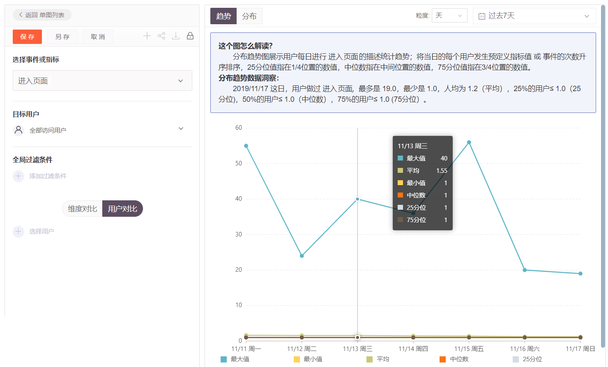
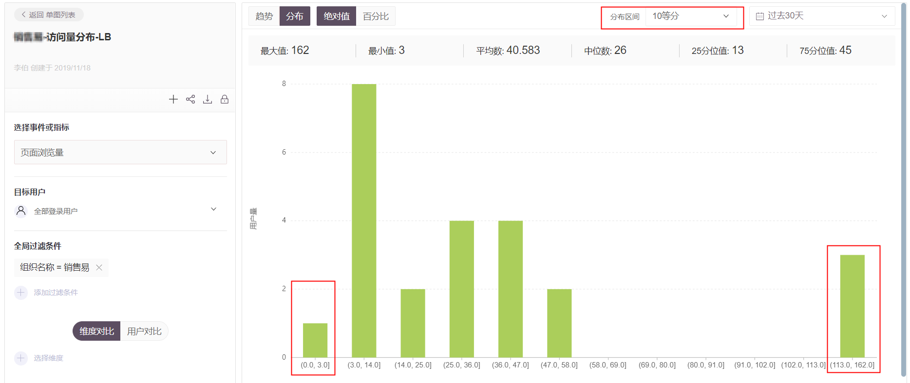

# 什么是分布分析

产品优化和运营是一个动态的过程，我们需要不断监测数据，调整产品设计或运营方法，然后继续监测效果。

分布分析功能，主要用来了解不同区间事件发生频次，不同事件计算变量加和，以及不同页面浏览时长等区间的用户数量分布。

GrowingIO的分布分析功能分为「趋势图」和「分布图」。

## 事件发生趋势图

趋势图展现了事件发生次数的“最大值、最小值、平均值、中位数、25 分位值和 75 分位值”几个关键数据指标的变化趋势，可以帮助用户快速掌握目标事件的整体分布趋势。

拿下图示的“进入页面”来示意：

* 最大值：当日用户发生“进入页面”事件次数的最大值 （即进入页面最多次的用户进入了多少次）；
* 最小值：当日用户发生“进入页面”事件次数的最小值 （即进入页面最少次的用户进入了多少次）；
* 平均值：当日发生“进入页面”事件的人均次数；
* 25分位：用户按照“进入页面”事件频次从小到大排序，前25%的用户进入次数小于等于多少（即假设有100个用户进入页面，25分位值为2，即前25个用户进入次数是1次或2次）；
* 中位数：用户按照“进入页面”事件频次从小到大排序，前50%的用户进入次数小于等于多少（即假设有100个用户进入页面，中位数值为4，即前50个用户页面次数是1-4次）；
* 75分位：用户按照“进入页面”事件频次从小到大排序，前75%的用户进入次数小于等于多少（即假设有100个用户进入页面，75分位数值为5，即前75个用户进入次数是1-5次）。

## 用户分布图

用户分布图根据您所选择的用户群、所选时间做的事件，帮您进行事件频次的分组和分组后的用户数统计。

分布算法中，会先找到分布中的分布极值。如果直接按照 10等分或者 5 等分进行拆分，很可能会遇到没有办法找到频次少的分布值。优先找到5分位、95分位的值，然后在5分位至95分位的数值范围内对数据区间进行等分，则会根据数据特征自动分层。

拿下图示的“页面浏览量”来示意：

* 第一个柱表示的含义是：时间范围内（过去30天），目标用户群 （**全部登录用户），**浏览页面中，浏览页面量从小到大排序，前5%的用户页面浏览量的范围及用户量。
* 最后一个柱表示的含义是：时间范围内（过去30天），目标用户群 （**全部登录用户），**浏览页面中，浏览页面量从小到大排序，后5%的用户页面浏览量的范围及用户量。
* 在排除**页面浏览量非常少**和**页面浏览量非常多**的**用户**后，帮助您了解按照页面浏览量几等分后，相应值的区间内有多少用户量。


**等分算法**

排除第一个和最后一个柱；剩下的页面浏览量范围是4-113；即中间90%的用户浏览页面量在4~113次。 想进一步确认浏览页面活跃的用户分布量，选择10等分，即（113-4+1 ）/10 = 11，每个区间间隔值为11，即（3-14\], \(14-25\], \(25-36\], \(36-47\],\(47-58\], \(58-69\], \(69-80\], \(80-91\], \(91-102\], \(102-113\] 不同页面浏览量区间上，用户数量。


