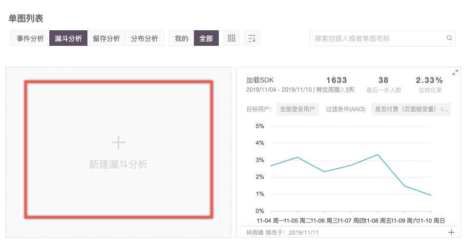
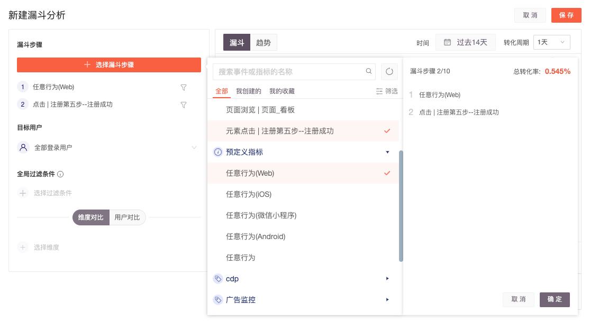
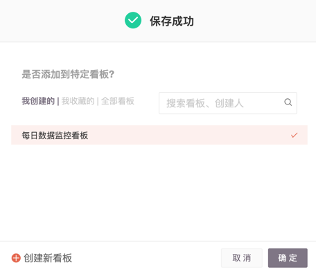
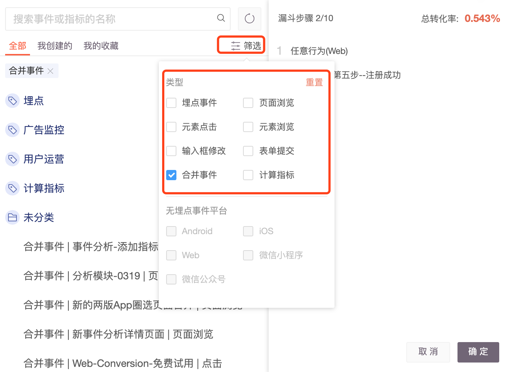

# 创建漏斗分析

## 操作步骤

一. 在顶部导航栏选择“**产品分析 > 漏斗分析”**，进入单图列表的漏斗分析模块。

二. 单击**新建漏斗分析**，进入**新建漏斗分析**页面。

三. 单击**选择漏斗步骤，**至少选择2个步骤，单击确定后展示漏斗视图。


* 漏斗的步骤可以通过拖拽调整顺序，单击已选行为后的  可对当前行为进行筛选。
* 选择漏斗步骤时，鼠标**悬停**在某个事件时，可以看到该事件的定义和过去 7 天的数据预览。


> 图例解读：过去7天（时间）内用户在任意时间完成第一步，并在1天（转化周期）内完成了第二步的占比为0.514%（第一步的转化率）。

| 参数 | 说明 |
| -- | -- |

| 目标用户 | 默认是“全部登录用户”，可以切换至“新访问用户”、“全部访问用户”、“新登录用户”以及用户自主创建的用户分群。比如要分析新用户的注册行为，可以设定目标用户为"新访问用户"。 |
| ---- | -------------------------------------------------------------------------------------- |

| 过滤条件 | <ul><li><strong>全局过滤条件</strong>：默认不加过滤，是针对整个漏斗的全局过滤。比如，如果想要看使用 Chrome 浏览器发起注册的转化漏斗，就可以将过滤条件设置为：浏览器＝Chrome</li><li><strong>每一步添加过滤</strong>：单击已选步骤右侧的 ，配置当前步骤单独的过滤条件。</li></ul> |
| ---- | ------------------------------------------------------------------------------------------------------------------------------------------------------------------------------------------------------------------------------------------------------------------------------------------------------------------------- |

| 时间 | 
时间是指用户进入漏斗的时间范围，也就是完成漏斗第一步的时间。

默认是“过去 14 天”，可以在此处切换成“今天”或者过去的一段时间。此处时间限定的是漏斗第一步，也就是用户进入转化漏斗的时间范围。
 |
| -- | -------------------------------------------------------------------------------------------------------------- |

| 转化周期 | 
指用户从漏斗第一步到完成之后每一步需要在转化周期时长内完成记作转化，否则记作流失。

默认是“ 1 天”，最长支持 90 天。 比如，转化周期设置为7天，是指用户完成漏斗第一步之后，需要在后续的 7 天内完成漏斗的最后一步才计为转化，否则会记为流失。
 |
| ---- | ----------------------------------------------------------------------------------------------------------------------------------------- |

| 漏斗图 | 按筛选条件展示每一步骤的整体转化率。 |
| --- | ------------------ |

| 趋势图 | 在筛选条件范围内展示每一步骤在每天的转化率。 |
| --- | ---------------------- |

| 维度对比 | 
针对某个维度，对比不同维度值的漏斗表现。

<strong>例如</strong>：我们可以对比『浏览器』维度，Chrome 和 Safari 的注册流表现是否有明显差异。Chrome 和 Safari 是『浏览器』维度的 2 个不同的值。可以看到两个浏览器在注册每一步的不同表现和整体转化率的不同表现，并且可以在右侧视图区域切换『趋势』对比它们的趋势情况。

<strong>注意</strong>：维度对比时，一般情况下，维度值的拆分只作用于漏斗第一步的人数统计。<strong>当使用事件级变量进行维度对比时，</strong>若检查到所有步骤中，均包含该事件变量。那么拆分后，第一步事件变量的值，将同时作为后续步骤的过滤条件。

例如：在转化周期内，用户同时浏览了商品A、B的详情页，将B商品加入购物车，并下单、支付成功。构建浏览商品详情-支付成功的转化漏斗，使用商品ID进行维度对比，商品A的整体转化率=0%，商品B的整体转化率=100%。
 |
| ---- | --------------------------------------------------------------------------------------------------------------------------------------------------------------------------------------------------------------------------------------------------------------------------------------------------------------------------------------------------------------------------------------------------------------------------------------------------------------- |

| 用户对比 | 
对比两个不同的用户群体的转化情况。

<strong>例如</strong>：某电商平台尝试唤醒近期不活跃的用户，并将用户分成 2 组，其中 1 组发了满减优惠券，另外 1 组发了立减优惠券，想要2组领取了优惠券之后的转化情况；此时可以创建 2 用户分群：『领取了满减券的用户』(2010人)和 『领取了立减券的用户』(1080人)，在漏斗用户对比时选择这 2 个用户分群并调整时间范围到用户领取优惠券之后的一段时间，就可以对比 2 个不同用户分群的转化情况了
 |
| ---- | -------------------------------------------------------------------------------------------------------------------------------------------------------------------------------------------------------------------------------------------------- |

五. 单击**保存**后弹出**添加到看板**，选择合适的看板后单击确定。

## 一键创建分群

在漏斗趋势图中，单击某一步骤柱状视图即可出现以下效果，选择创建分群快速创建当前步骤的用户分群。


限制条件：快速创建分群受到用户分群模块权限限制，如果您没有用户分群权限，将无法从漏斗分析趋势图中快速创建分群。


## **漏斗可选步骤的分类**

漏斗中的可选事件，包括了无埋点事件、埋点事件和复合指标，可以在同一个漏斗分析不同步骤中同时使用。

* 无埋点事件可用事件类型包括：页面浏览、元素浏览、元素点击、输入框修改、表单提交。
* 埋点事件，在“类型” 中选择“埋点事件”即可。
* 复合指标包括：合并事件、计算指标。

