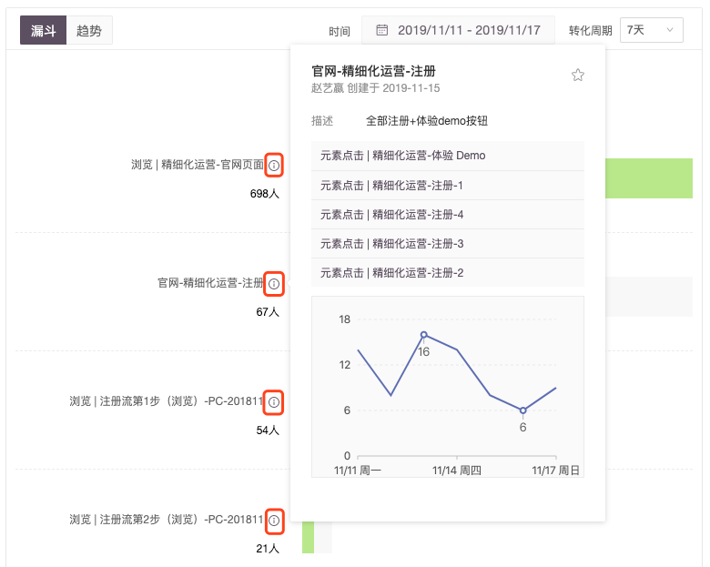

# 漏斗分析结果解读

| 项 | 说明 |
| :--- | :--- |

| 单位为人数 | GrowingIO 的漏斗基于用户行为分析，漏斗每一步的数据统计的是“**人数**”，也就是每一步有多少人完成；如果同1个用户在选定的时间范围完成了某个步骤 2 次，算作 1 \(单位：人\)； |
| :--- | :--- |

<table>
  <thead>
    <tr>
      <th style="text-align:left">&#x6B65;&#x9AA4;&#x65F6;&#x5E8F;</th>
      <th style="text-align:left">
        
&#x5728;&#x8F6C;&#x5316;&#x5468;&#x671F;&#x5185;&#x6F0F;&#x6597;&#x7B2C;&#x4E00;&#x6B65;&#x548C;&#x7B2C;&#x4E8C;&#x6B65;&#x4E3A;&#x4F8B;&#xFF1A;

        
&#x5E38;&#x89C4;&#x987A;&#x5E8F;&#xFF1A;&#x5982;&#x679C;&#x7528;&#x6237;&#x5148;&#x5B8C;&#x6210;&#x7B2C;&#x4E00;&#x6B65;&#x53C8;&#x5B8C;&#x6210;&#x7B2C;&#x4E8C;&#x6B65;&#xFF0C;&#x5219;&#x7B2C;&#x4E8C;&#x6B65;&#x7528;&#x6237;&#x91CF;
          +1 &#xFF1B;

        
&#x975E;&#x5E38;&#x89C4;&#x987A;&#x5E8F;&#xFF1A;&#x7528;&#x6237;&#x5148;&#x5B8C;&#x6210;&#x7B2C;&#x4E8C;&#x6B65;&#x518D;&#x5B8C;&#x6210;&#x7B2C;&#x4E00;&#x6B65;

        <ul>
          <li>&#x4ECA;&#x65E5;&#x6570;&#x636E;&#xFF1A;&#x5728;&#x540C;&#x4E00;&#x5C0F;&#x65F6;&#x5185;&#x5B8C;&#x6210;&#xFF0C;&#x5219;&#x7B2C;&#x4E8C;&#x6B65;&#x7528;&#x6237;&#x91CF;
            +1&#xFF1B;&#x4E0D;&#x5728;&#x540C;&#x4E00;&#x5C0F;&#x65F6;&#x5B8C;&#x6210;&#xFF0C;&#x7B2C;&#x4E8C;&#x6B65;&#x7528;&#x6237;+0</li>
          <li>&#x4ECA;&#x65E5;&#x524D;&#x6570;&#x636E;&#xFF1A;&#x5728;&#x540C;&#x4E00;&#x5929;&#x5185;&#x5B8C;&#x6210;&#xFF0C;&#x5219;&#x7B2C;&#x4E8C;&#x6B65;&#x7528;&#x6237;&#x91CF;
            +1&#xFF1B;&#x4E0D;&#x5728;&#x540C;&#x4E00;&#x5929;&#x5B8C;&#x6210;&#xFF0C;&#x7B2C;&#x4E8C;&#x6B65;&#x7528;&#x6237;+0</li>
        </ul>
      </th>
    </tr>
  </thead>
  <tbody></tbody>
</table>

举例来说，您在 6 月 7 日圈选了某个事件 A ，数据回溯 7 天，事件 A 的有效期是从 6 月 1 日开始的；如果您在漏斗中使用了事件 A ，并且时间选择了「 5 月 20 日至昨天」，其他事件的有效期从 5 月 1 日开始，而事件 A 是从 6 月 1 日开始；您需要注意到，漏斗的转化率数据受到了事件 A 有效期的影响。

