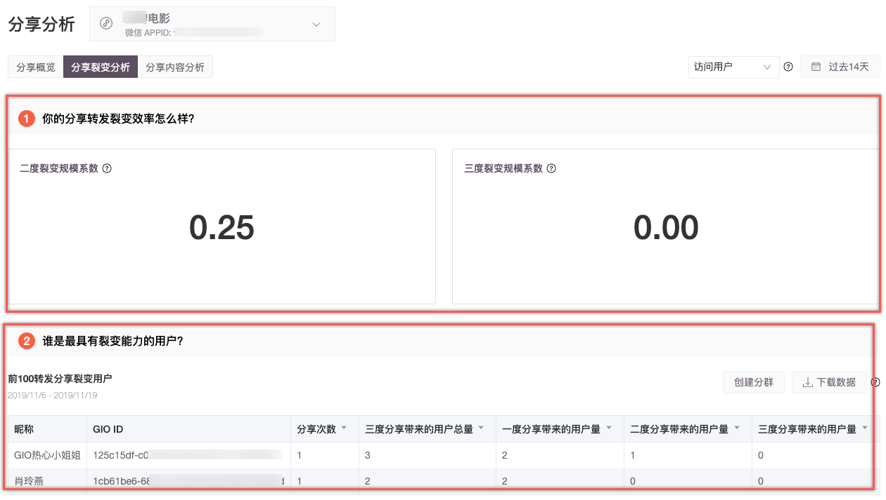
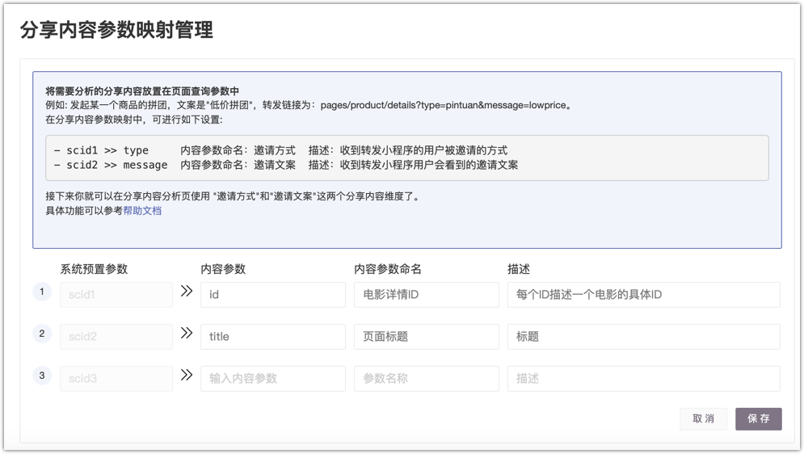

# 分享分析

## 什么是分享分析

小程序处在微信生态下，分享功能是小程序拉新、获客的重要途径。GrowingIO推出了分享分析，帮助您一目了然看到您小程序的分享获客、拉新、转化等数据，并进一步挖掘分享的KOL。

## 前提条件 

GrowingIO会默认帮您统计转发事件（分享用户量和分享次数）。如果想统计到”转发分享带来的用户“，则需要在集成小程序SDK时开启分析分享功能。 详细请参考”微信小程序SDK &gt; [SDK参数配置](../../../developer-manual/sdkintegrated/other-sdk/minp-sdk.md#sdk-can-shu-pei-zhi)“。

## 使用分享分析 

一. 在顶部导航栏选择“**获客分析 &gt; 分享分析”**，进入分享分析页面。

二. 选择待分析的小程序应用、用户群、时间范围，查看分析数据。

分析数据分为以下三部分：

### ​分享概览

| 模块 | 说明 |
| :--- | :--- |

| 1-选择应用 | 在集成多个小程序应用时，用来切换小程序。 |
| :--- | :--- |

| 2-选择分析内容 | 选择分析概览。 |
| :--- | :--- |

<table>
  <thead>
    <tr>
      <th style="text-align:left">3-&#x9009;&#x62E9;&#x7528;&#x6237;&#x7FA4;</th>
      <th style="text-align:left">
        <ul>
          <li>&#x8BBF;&#x95EE;&#x7528;&#x6237;&#xFF1A;&#x5373;&#x201D;&#x8F6C;&#x53D1;&#x5206;&#x4EAB;&#x5E26;&#x6765;&#x7684;&#x7528;&#x6237;&#x91CF;&#x201C;&#xFF0C;&#x7EDF;&#x8BA1;&#x7684;&#x662F;&#x7531;&#x5206;&#x4EAB;&#x5E26;&#x6765;&#x7684;&#x5168;&#x90E8;&#x8BBF;&#x95EE;&#x7528;&#x6237;&#x91CF;&#xFF0C;&#x201D;&#x8F6C;&#x5316;&#x76EE;&#x6807;&#x201C;&#x7EDF;&#x8BA1;&#x7684;&#x662F;&#x7531;&#x5206;&#x4EAB;&#x5E26;&#x6765;&#x7684;<b>&#x5168;&#x90E8;&#x8BBF;&#x95EE;&#x7528;&#x6237;</b>&#x4E2D;&#x8F6C;&#x5316;&#x7684;&#x7528;&#x6237;&#x91CF;&#xFF0C;KOL&#x5206;&#x4EAB;&#x5E26;&#x6765;&#x7684;&#x4E09;&#x5EA6;&#x7528;&#x6237;&#x91CF;&#xFF0C;&#x4E5F;&#x5728;&#x201D;&#x5168;&#x90E8;&#x8BBF;&#x95EE;&#x7528;&#x6237;&#x201C;&#x57FA;&#x7840;&#x4E0A;&#x8BA1;&#x7B97;&#x3002;</li>
          <li>&#x65B0;&#x8BBF;&#x95EE;&#x7528;&#x6237;&#xFF1A;&#x5373;&#x201C;&#x8F6C;&#x53D1;&#x5206;&#x4EAB;&#x5E26;&#x6765;&#x7684;&#x7528;&#x6237;&#x91CF;&#x201D;&#xFF0C;&#x7EDF;&#x8BA1;&#x7684;&#x662F;&#x7531;&#x5206;&#x4EAB;&#x5E26;&#x6765;&#x7684;&#x65B0;&#x8BBF;&#x95EE;&#x7528;&#x6237;&#x91CF;&#xFF0C;&#x201C;&#x8F6C;&#x5316;&#x76EE;&#x6807;&#x201D;&#x7EDF;&#x8BA1;&#x7684;&#x662F;&#x7531;&#x5206;&#x4EAB;&#x5E26;&#x6765;&#x7684;<b>&#x65B0;&#x8BBF;&#x95EE;&#x7528;&#x6237;</b>&#x4E2D;&#x8F6C;&#x5316;&#x7684;&#x7528;&#x6237;&#x91CF;&#xFF0C;KOL
            &#x5206;&#x4EAB;&#x5E26;&#x6765;&#x7684;&#x4E09;&#x5EA6;&#x7528;&#x6237;&#x91CF;&#xFF0C;&#x4E5F;&#x5728;&#x201C;&#x65B0;&#x8BBF;&#x95EE;&#x7528;&#x6237;&#x201D;&#x57FA;&#x7840;&#x4E0A;&#x8BA1;&#x7B97;&#x3002;</li>
        </ul>
      </th>
    </tr>
  </thead>
  <tbody></tbody>
</table>

| 4-选择时间 | 选择分析的时间范围，预置常用的事件范围（昨天、过去7天、过去14天、过去30天）。 |
| :--- | :--- |

| 5-分项数据总览 | 展示分享产生的用户数、次数，一级由转发分享带来的整体获客和拉新的用户量。 |
| :--- | :--- |

| 6-病毒系数变化趋势 | 计算整体的病毒系数，并且按天展示病毒系数的变化。 |
| :--- | :--- |

| 7-设置转化目标 | 选择您关注的行为作为转化目标，了解分享带来的用户量中，转化的用户有多少，并可以直观的查看转化率、转化金额、转化的平均金额等 |
| :--- | :--- |

<table>
  <thead>
    <tr>
      <th style="text-align:left">8-&#x8F6C;&#x5316;&#x76EE;&#x6807;&#x7684;&#x8861;&#x91CF;&#x6307;&#x6807;&#x9009;&#x62E9;</th>
      <th
      style="text-align:left">
        
&#x5355;&#x51FB;
          &#xFF0C;&#x9009;&#x62E9;&#x8F6C;&#x5316;&#x76EE;&#x6807;&#x7684;&#x8861;&#x91CF;&#x6307;&#x6807;&#x3002;

        <ul>
          <li>&#x7528;&#x6237;&#x91CF;</li>
          <li>&#x8F6C;&#x5316;&#x7387;</li>
          <li>&#x6B21;&#x6570;</li>
        </ul>
        </th>
    </tr>
  </thead>
  <tbody></tbody>
</table>

<table>
  <thead>
    <tr>
      <th style="text-align:left">9-&#x5206;&#x4EAB;&#x6570;&#x636E;&#x4E0B;&#x94BB;</th>
      <th style="text-align:left">
        <ul>
          <li>&#x5141;&#x8BB8;&#x8FDB;&#x4E00;&#x6B65;&#x5BF9;&#x89E6;&#x53D1;&#x5206;&#x4EAB;&#x4E8B;&#x4EF6;&#x7684;&#x7528;&#x6237;&#x8FDB;&#x884C;&#x90E8;&#x5206;&#x7EF4;&#x5EA6;&#x5426;&#x62C6;&#x5206;&#x8BA1;&#x7B97;&#x3002;
            <ul>
              <li><b>&#x5E7F;&#x544A;&#x7C7B;&#x7EF4;&#x5EA6;</b>&#xFF08;&#x5E7F;&#x544A;&#x6765;&#x6E90;&#x3001;&#x5E7F;&#x544A;&#x540D;&#x79F0;&#x3001;&#x5E7F;&#x544A;&#x5185;&#x5BB9;&#x3001;&#x5E7F;&#x544A;&#x5173;&#x952E;&#x5B57;&#x3001;&#x5E7F;&#x544A;&#x5A92;&#x4ECB;&#xFF09;&#xFF1A;&#x7EDF;&#x8BA1;&#x6BCF;&#x4E2A;&#x5E7F;&#x544A;&#x6E20;&#x9053;&#x83B7;&#x53D6;&#x7684;&#x7528;&#x6237;&#x4E2D;&#xFF0C;&#x89E6;&#x53D1;&#x5206;&#x4EAB;&#x7684;&#x7528;&#x6237;&#x6570;&#xFF0C;&#x6B21;&#x6570;&#xFF0C;&#x4EE5;&#x53CA;&#x7531;&#x8F6C;&#x53D1;&#x5206;&#x4EAB;&#x5E26;&#x6765;&#x7684;&#x6574;&#x4F53;&#x83B7;&#x5BA2;&#x548C;&#x62C9;&#x65B0;&#x7684;&#x7528;&#x6237;&#x91CF;&#xFF0C;&#x4EE5;&#x53CA;&#x5176;&#x4E2D;&#x8F6C;&#x5316;&#x7684;&#x7528;&#x6237;&#x91CF;&#x3002;&#x4ECE;&#x800C;<b>&#x6DF1;&#x5165;&#x5224;&#x65AD;&#x83B7;&#x5BA2;&#x6E20;&#x9053;&#x7684;&#x7528;&#x6237;&#x8F6C;&#x53D1;&#x5206;&#x4EAB;&#x7684;&#x83B7;&#x5BA2;&#x548C;&#x8F6C;&#x5316;&#x6548;&#x7387;</b>
              </li>
              <li><b>&#x7528;&#x6237;&#x53D8;&#x91CF;&#x7C7B;&#x7EF4;&#x5EA6;</b>&#xFF08;&#x6027;&#x522B;&#x3001;&#x57CE;&#x5E02;&#x3001;&#x7701;&#x3001;&#x56FD;&#x5BB6;&#xFF09;&#xFF1A;&#x7EDF;&#x8BA1;&#x4E0D;&#x540C;&#x7684;&#x7528;&#x6237;&#x5C5E;&#x6027;&#x4E0B;&#xFF0C;&#x89E6;&#x53D1;&#x5206;&#x4EAB;&#x7684;&#x7528;&#x6237;&#x6570;&#xFF0C;&#x6B21;&#x6570;&#xFF0C;&#x4EE5;&#x53CA;&#x7531;&#x8F6C;&#x53D1;&#x5206;&#x4EAB;&#x5E26;&#x6765;&#x7684;&#x6574;&#x4F53;&#x83B7;&#x5BA2;&#x548C;&#x62C9;&#x65B0;&#x7684;&#x7528;&#x6237;&#x91CF;&#xFF0C;&#x4EE5;&#x53CA;&#x5176;&#x4E2D;&#x8F6C;&#x5316;&#x7684;&#x7528;&#x6237;&#x91CF;&#x3002;&#x4ECE;&#x800C;<b>&#x6DF1;&#x5165;&#x5224;&#x65AD;&#x4E0D;&#x540C;&#x7C7B;&#x578B;&#x7684;&#x7528;&#x6237;&#x8F6C;&#x53D1;&#x5206;&#x4EAB;&#x7684;&#x83B7;&#x5BA2;&#x548C;&#x8F6C;&#x5316;&#x6548;&#x7387;</b>&#x3002;</li>
            </ul>
          </li>
          <li>&#x9009;&#x62E9;&#x81EA;&#x5B9A;&#x4E49;&#x6307;&#x6807;&#xFF0C;&#x67E5;&#x770B;&#x8F6C;&#x5316;&#x76EE;&#x6807;&#x76F8;&#x5173;&#x7684;&#x66F4;&#x591A;&#x6307;&#x6807;&#x3002;</li>
          <li>&#x7EAC;&#x5EA6;&#x503C;&#x8FC7;&#x6EE4;&#xFF0C;&#x53EF;&#x4EE5;&#x914D;&#x7F6E;&#x7EF4;&#x5EA6;&#x62C6;&#x5206;&#x8BA1;&#x7B97;&#xFF0C;&#x652F;&#x6301;&#x8FDB;&#x884C;&#x591A;&#x7EF4;&#x5EA6;&#x4EA4;&#x4E92;&#x7684;&#x6DF1;&#x5165;&#x5206;&#x6790;&#x3002;</li>
        </ul>
      </th>
    </tr>
  </thead>
  <tbody></tbody>
</table>

对分享来说，我们最关键的，除了知道分享的ROI，针对用户颗粒度下降，需要知道谁是产品中最能带来用户的“超级用户”。

通常情况下，我们一般评估一个用户直接带来的用户量有多少，但是在微信体系下，就忽略了用户可能隐藏存在的巨大的社交关系。GrowingIO分享用户分析，帮助您定位直接一度分享和三度分享下的“分享超级用户”。

#### 具体解释： 

三度分享计算举例：用户A 分享带来了用户B， 用户B 的分享带来了用户C，用户C带来了用户D

三度分享计算及结果如下： 用户A带来的三度分享用户总量是 3 （即用户B、用户C和用户D），其中一度、二度、三度分别是 1，1，1； 用户B带来的三度分享用户总量是2，其中一度、二度、三度分别是：1，1，0； 用户C带来的三度分享用户总量是1，其中一度，二度，三度分别是：1，0，0。

如果一个用户带来的总用户量多，且一度用户很多，说明这个用户有很大的直接社交圈，即一般意义上的KOL（用户的社交关系存量是较大的）。

如果一个用户带来的总用户量多，但是一度用户不多，而二度用户较多，说明这个用户和有较大直接社交圈的人有联系，即一般意义上是KOL的影响人（社交关系中认识社交关系存量较大的用户）。

| 模块 | 说明 |
| :--- | :--- |

<table>
  <thead>
    <tr>
      <th style="text-align:left">1-&#x4E8C;&#x4E09;&#x5EA6;&#x88C2;&#x53D8;&#x89C4;&#x6A21;&#x7CFB;&#x6570;</th>
      <th
      style="text-align:left">
        <ul>
          <li>&#x4E8C;&#x5EA6;&#x88C2;&#x53D8;&#x89C4;&#x6A21;&#x7CFB;&#x6570;&#x7528;&#x6765;&#x6307;&#x793A;&#x5206;&#x4EAB;&#x83B7;&#x5BA2;&#x4E2D;&#xFF0C;&#x4E8C;&#x5EA6;&#x5230;&#x4E00;&#x5EA6;&#x7684;&#x5E73;&#x5747;&#x88C2;&#x53D8;&#x89C4;&#x6A21;&#xFF08;&#x4E8C;&#x5EA6;&#x88C2;&#x53D8;&#x89C4;&#x6A21;&#x7CFB;&#x6570;=&#x4E8C;&#x5EA6;&#x8F6C;&#x53D1;&#x5E26;&#x6765;&#x7684;&#x7528;&#x6237;&#x52A0;&#x548C;
            / &#x4E00;&#x5EA6;&#x8F6C;&#x53D1;&#x5E26;&#x6765;&#x7684;&#x7528;&#x6237;&#x52A0;&#x548C;&#xFF09;</li>
          <li>&#x4E09;&#x5EA6;&#x88C2;&#x53D8;&#x89C4;&#x6A21;&#x7CFB;&#x6570;&#x7528;&#x6765;&#x6307;&#x793A;&#x5206;&#x4EAB;&#x83B7;&#x5BA2;&#x4E2D;&#xFF0C;&#x4E09;&#x5EA6;&#x5230;&#x4E00;&#x5EA6;&#x7684;&#x5E73;&#x5747;&#x88C2;&#x53D8;&#x89C4;&#x6A21;&#xFF08;&#x4E09;&#x5EA6;&#x88C2;&#x53D8;&#x89C4;&#x6A21;&#x7CFB;&#x6570;=&#x4E09;&#x5EA6;&#x8F6C;&#x53D1;&#x5E26;&#x6765;&#x7684;&#x7528;&#x6237;&#x52A0;&#x548C;
            / &#x4E00;&#x5EA6;&#x8F6C;&#x53D1;&#x5E26;&#x6765;&#x7684;&#x7528;&#x6237;&#x52A0;&#x548C;&#xFF09;</li>
        </ul>
        </th>
    </tr>
  </thead>
  <tbody></tbody>
</table>

<table>
  <thead>
    <tr>
      <th style="text-align:left">2-&#x8F6C;&#x53D1;&#x5206;&#x4EAB;&#x88C2;&#x53D8;Top100&#x7528;&#x6237;</th>
      <th
      style="text-align:left">
        
&#x6700;&#x6709;&#x88C2;&#x53D8;&#x80FD;&#x529B;&#x7684;&#x524D;100&#x4F4D;&#x7528;&#x6237;&#x3002;

        <ul>
          <li>&#x521B;&#x5EFA;&#x5206;&#x7FA4;&#xFF1A;&#x5C06;&#x5F53;&#x524D;&#x5177;&#x6709;&#x88C2;&#x53D8;&#x80FD;&#x529B;&#x7684;&#x7528;&#x6237;&#x8FDB;&#x884C;&#x5206;&#x7FA4;&#x3002;</li>
          <li>&#x4E0B;&#x8F7D;&#x6570;&#x636E;&#xFF1A;&#x4E0B;&#x8F7D;&#x5F53;&#x524D;&#x8868;&#x683C;&#x5C55;&#x793A;&#x7684;&#x6570;&#x636E;&#x3002;</li>
        </ul>
        

        </th>
    </tr>
  </thead>
  <tbody>
    <tr>
      <td style="text-align:left"></td>
      <td style="text-align:left"></td>
    </tr>
  </tbody>
</table>

| **模块** | 说明 |
| :--- | :--- |
| 1-发起分享最多的页面 | 了解用户在哪些页面发起分享。 |
| 2-被分享最多的页面的属性 | 了解用户在具有哪些属性的页面发起分享。 |
| 3-用户通过哪些分享进入小程序 | [配置内容参数](shareanalysis.md#pei-zhi-ye-mian-can-shu)，分享所带来的用户被哪些内容吸引、转化。 |

### 配置内容参数

内容参数即您分享页面URL中的查询参数，您可以将查询参数设置为分享页面的页面变量，在分析时使用此变量对统计值进行拆分。

一. 在分享内容分析页面最下方单击”**配置内容参数**“，如已配置，则单击**映射管理**，进入**分享内容参数映射管理**页面。


GrowingIO已预置3个内容参数，您需使用映射功能关联您的内容参数。


二. 配置内容参数，并单击保存。

以`pages/product/details?type=pintuan&message=lowprice。`为例，您可以将type 、message设置为内容参数。

## 指标解释

* 分享用户数：触发转发分享事件的访问用户数量；
* 分享次数：转发分享事件被触发的次数；
* 转发分享带来的用户数：通过点击其他用户分享到 好友聊天/群聊天 中的小程序，进入小程序的用户量；
* 选择相应的转化目标：通过点击其他用户分享到 好友聊天/群聊天 中的小程序进入小程序的用户中，在选择的时间周期中，完成相应转化目标事件的用户数;

