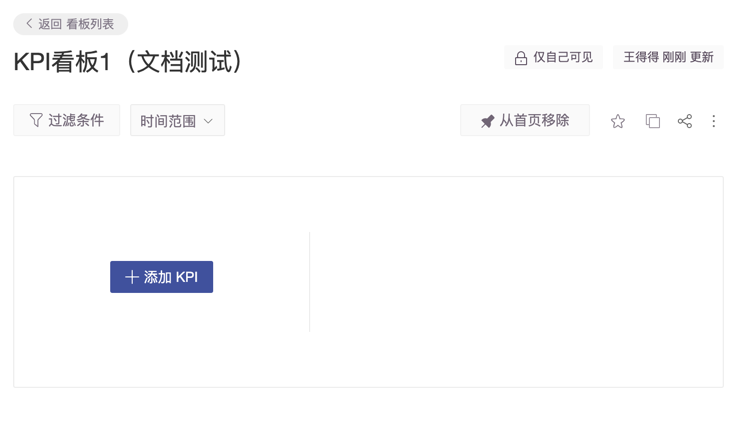
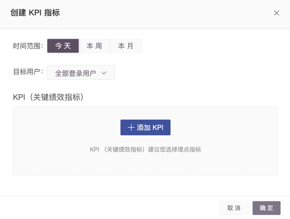
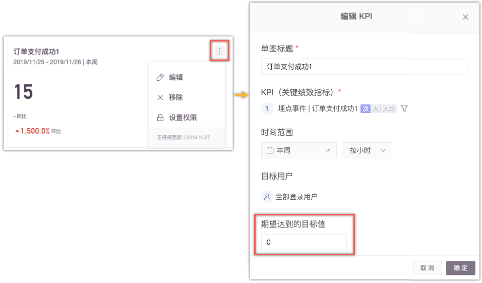
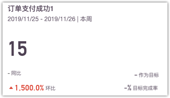
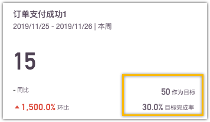
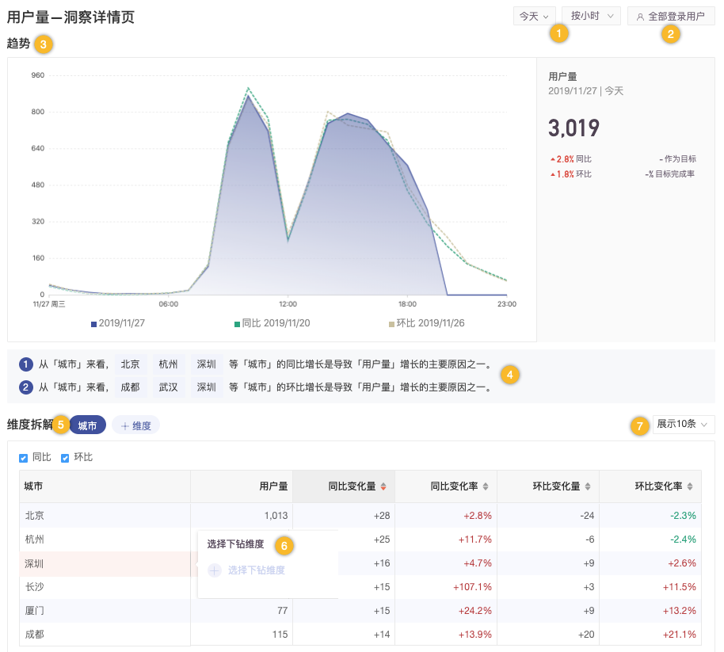
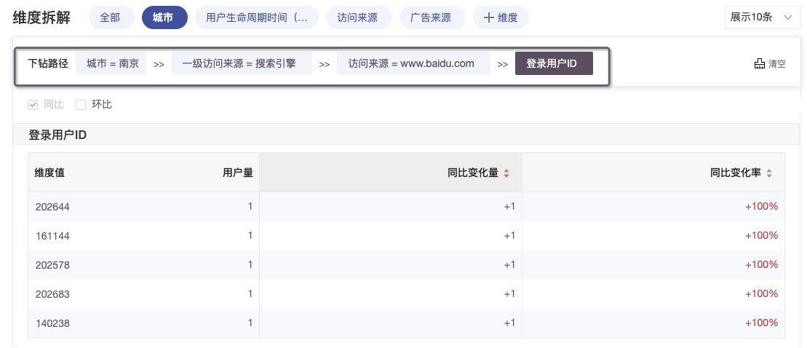

# KPI看板

## 简介 

KPI看板可以帮助业务负责人在 GrowingIO 平台上监控 KPI 数据，判断 KPI 是否符合预期。若数据与预期不符，用户可以借助维度拆解和下钻，迅速找到影响KPI表现的原因。

您可以将您的 KPI 放在 KPI 看板上，一站式获得KPI所有信息，避免KPI分散在各处。每一个KPI看板可以创建 8 个KPI指标，您可以把对您的组织最重要的KPI 放在一个看板里，对核心指标一览无余。

**以某电商公司 KPI 看板为例子：**

我们将销售量、销售额、用户量、复购、转发等放在KPI看板。您打开KPI看板后，借助大数字图，所有核心指标表现一览无余，帮您迅速了解整体表现和有异常的 KPI。比如，我们可以看到下图中**复购次数**这个KPI出现了问题。同比出现了超过20%的下降。

## **规划KPI数据** 

> 如果已经进行了对KPI的规划和实施，此步骤可以忽略。

首先要确定什么是你的KPI，其次确定要通过哪些维度去监控拆解KPI。

若购买成功是你的核心KPI，你会通过商品品类、渠道、会员等级去监控购买。那么你可以设置购买成功为自定义事件，用商品品类、渠道、会员等级为变量。

将这些数据上传给 GrowingIO之后，即可通过创建KPI单图看到这个KPI对应的数据。

## 创建KPI单图

一. 在顶部导航栏选择"**看板** > **KPI看板**"，进入看板列表的KPI看板列表。

二. 单击列表上方的**创建看板**，新建一个KPI看板并进入看板内。

三. 单击**添加KPI**，弹出**创建KPI指标**页面。

| 参数 | 说明 |
| -- | -- |

| 时间范围 | 
选择时间范围，选择 今天、本周、本月来监测 KPI 指标的时间范围。
<ul><li>若您选择今天，可以看到今天的小时级别数据，如果你对某一个指标的关注度是每小时都会看一看，或者每半天都会看一下，建议选择今天。</li><li>若您选择本周（不包括今天），可以看到本周的天级别数据，如果你对某一个指标的关注度是每天都会看一看，周末会做一个总结报告，建议选择本周。</li><li>若您选择本月（不包括今天），可以看到本月天级别的KPI数据，如果你对某一个指标的关注度是每天或者周都会看一看，月会做一个总结报告，建议选择本月。</li></ul> |
| ---- | -------------------------------------------------------------------------------------------------------------------------------------------------------------------------------------------------------------------------------------------------------------------------------------- |

| 目标用户 | 设置目标人群，以便于了解特殊人群的KPI表现，如重新购买，新注册等。 |
| ---- | ---------------------------------- |

| KPI指标 | 
选择KPI指标。

KPI 由 事件，事件的度量方式（人 次 人均）和 过滤条件构成，以下指标都可以是 KPI

那么 购买人数， 购买次数 ，平均购买次数， 购买金额，手机购买量 等都可以成为选项。

他可以借助事件 “购”买， “购买”事件的度量方式 人， 次， 人均， 事件的变量：金额，品类等组合构成。

注：KPI 作为核心业务指标，需要通过业务维度对其进行拆解，同时对数据的准确性稳定性有较高的要求，我们更建议您采用埋点指标。
 |
| ----- | ------------------------------------------------------------------------------------------------------------------------------------------------------------------------------------------------------------------------------------------------------ |

## 设置KPI目标

您可以对KPI设置目标，即使观察目标进度是否符合预期。

在KPI看板内部，单击单个KPI指标框右上角的  选择编辑，在编辑页面设置目标值。

设置完成后即可在单个KPI框右下角查看目标完成度。

| 未设置目标值                                                                                | 
已

设置目标值
                                                       |
| ------------------------------------------------------------------------------------- | -------------------------------------------------------------------------- |
|   |   |

| 参数 | 说明 |
| -- | -- |

| 标题 | 我们默认用了事件名称来指代标题，您可以通过KPI单图右上角的操作按钮进行编辑。建议标题设置一定要简单明了，所有人看到标题后就能明白它的业务含义。 |
| -- | ------------------------------------------------------------------------ |

| 时间范围 | 
考察KPI的范围，一般情况下公司用今天、本周、本月来看KPI的表现。

在编辑时您可以更灵活的选择时间。
 |
| ---- | ---------------------------------------------------------------- |

| 同比 | 
同比是一个业务概念，是基于业务周期的定义。

对比规则：本周比上周、本月比上月、今年比去年。

如果今天是周三，那么本周比上周就是本周一二三的数据比上周一二三的数据。
 |
| -- | ---------------------------------------------------------------------------------------------------- |

| 环比 | 
定义为这个N天比上个N天。

比如：今天比昨天，过去7天的数据比过去8~14天数据，环比更关注业务的连续性。
 |
| -- | ------------------------------------------------------------------ |

| 目标 | 
给予所选时间范围和粒度的目标。比如本周目标，本月目标等。对于所选时间范围和粒度的KPI您可以设定对应的目标。

注：当所选时间范围发生变化时，目标需要重新填写。
 |
| -- | -------------------------------------------------------------------------------------------- |

| 目标完成率 | 实际KPI表现/目标值，您可以借助目标完成率来追踪进程是否符合预期。 |
| ----- | ---------------------------------- |

当你发现KPI不符合预期，点击KPI单图进入KPI详情页，详情页将帮助你快速找到数据波动的原因。

KPI详情页构成：

| 项         | 说明                                                        |
| --------- | --------------------------------------------------------- |
| 1-时间范围与粒度 | 灵活选择事件与粒度。                                                |
| 2-用户范围    | 更改目标人群。                                                   |
| 3-趋势图     | 趋势线图，帮助您监测 KPI 趋势与波动状况。                                   |
| 4-趋势图洞察   | 基于您关注的业务维度，直接呈现 KPI 变化的主要影响因子。快速理解导致数据波动的核心原因。            |
| 5-维度拆解    | 您可以按照业务维度对您的KPI进行拆解，找到 KPI 变化的影响因子。同时提供不同业务维度下的数据变化量与变化率。 |
| 6-选择下钻维度  | 单击维度列单元格可以对维度进行下钻。可以根据您的业务思路，不断拆解下钻找到最小粒度的原因              |

下钻示例：

##
