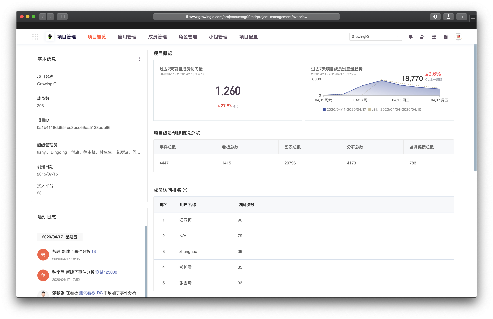
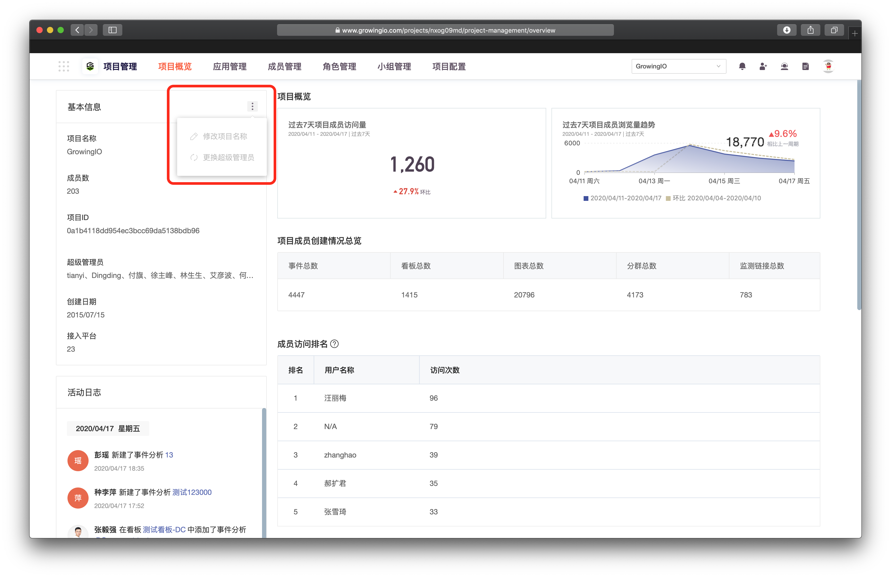

# 项目概览-done

## 用途

通过项目概览可以基板了解项目中的使用情况与基本信息 。

项目概览包括项目基本信息、项目成员创建情况总览、项目成员使用情况、活动日志。

## 查看项目基本信息

1. 进入项目管理界面。默认进入第一个页签**项目概览**。

* 基本信息：项目名称、超级管理员、应用数、成员数、项目ID、创建日期；
* 创建情况总览：事件总数、看板总数、图表总数、分群总数、监测链接总数；
* 成员使用情况（过去7天）：项目成员访问量、项目成员浏览量趋势、项目成员访问量排名、项目成员访问量趋势、最热看板、最热单图；
* 活动日志：您的成员在项目中的协作日志，帮助您了解您的分群、事件的新建和变更情况。

## 修改项目名称

1. 单击基本信息右侧的  选择**修改项目名称**。


只有 超级管理员 拥有权限**修改项目名称**。


## 更换超级管理员

1. 单击基本信息右侧的  选择**更换超级管理员**
2. 通过身份验证后选择项目内其他成员成为项目新的超级管理员。


* 一个项目可以有多个超级管理员；
* 超级管理员只能转让给项目内其他非超级管理员角色成员；
* 转让超级管理员后该成员成为项目的超级管理员，同时您的项目角色将变为项目管理员。


