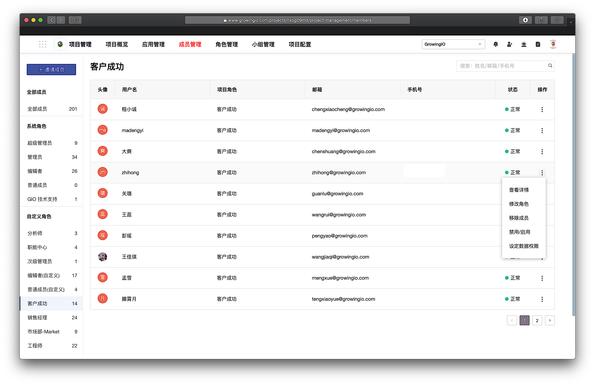
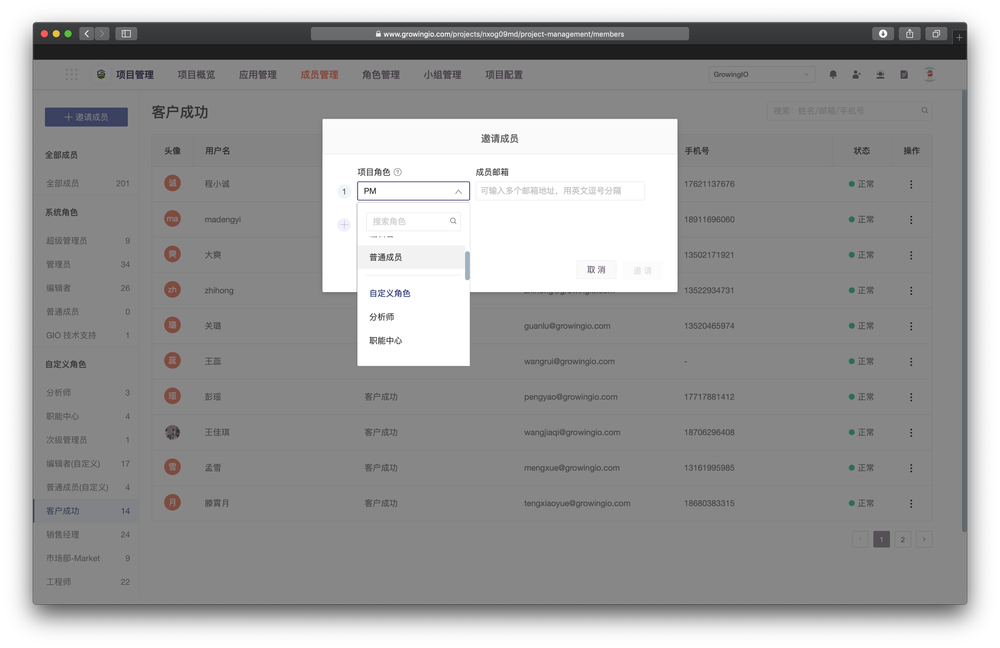
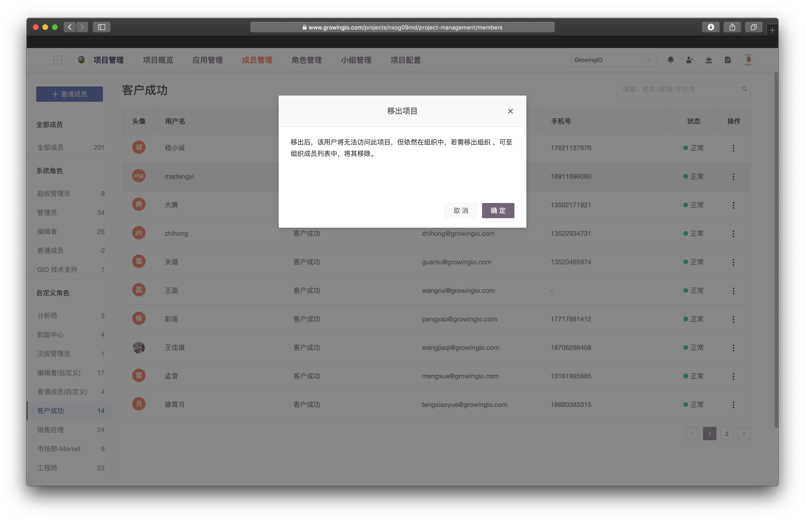
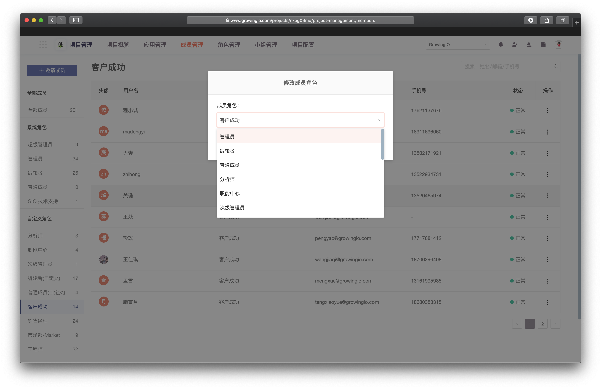
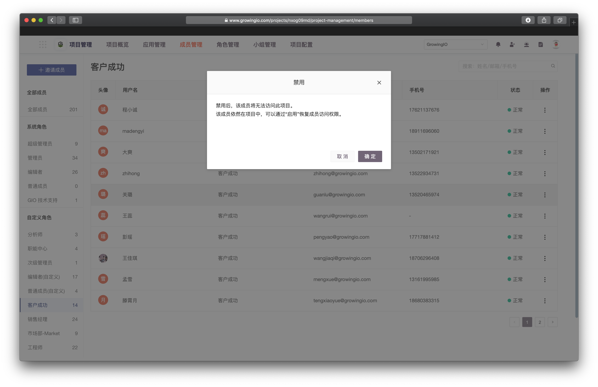

# 成员管理

## **用途**

管理员可在成员管理模块，完成对于项目内成员的管理工作，包含 邀请新成员、移除成员、设定成员角色、设置数据权限。

## **界面说明**

1. 进入项目管理界面，选择顶部导航栏 **成员管理** 页签。


 您可以在左侧栏，依据角色分类查看成员列表。


## 邀请成员

1.点击，邀请成员。  
  
2 . 选择成员项目角色，邀请对象的邮箱 。  
  
3. 被要请对象，将在邮箱中收到GrowingIO ，发送的邀请邮件 。点击进入项目即可。


成员邮箱以 『逗号』分隔 可同时邀请多位成员。


## 移除成员

1. 选择 非超级管理员角色 的成员。
2. 点击操作 - 移除成员 。
   该成员将从项目成员列表中移除。


移出后，该用户将无法访问此项目，但依然在组织中，若需移出组织 ，可由组织管理员至组织成员列表中，将其移除。


## 修改角色

1. 选择 需要修改角色的成员。
2. 点击操作 - 修改角色，选择预期修改的角色，可以成功修改用户角色。


非超级管理员角色，无法将成员修改为超级管理员。


## 启用/禁用

1. 选择待处理的用户。
2. 点击操作 - 禁用/启用，用户状态修改成功。


禁用后，该成员将无法访问此项目。

被禁用的成员依然在项目中，可以通过“启用”恢复成员访问权限。


