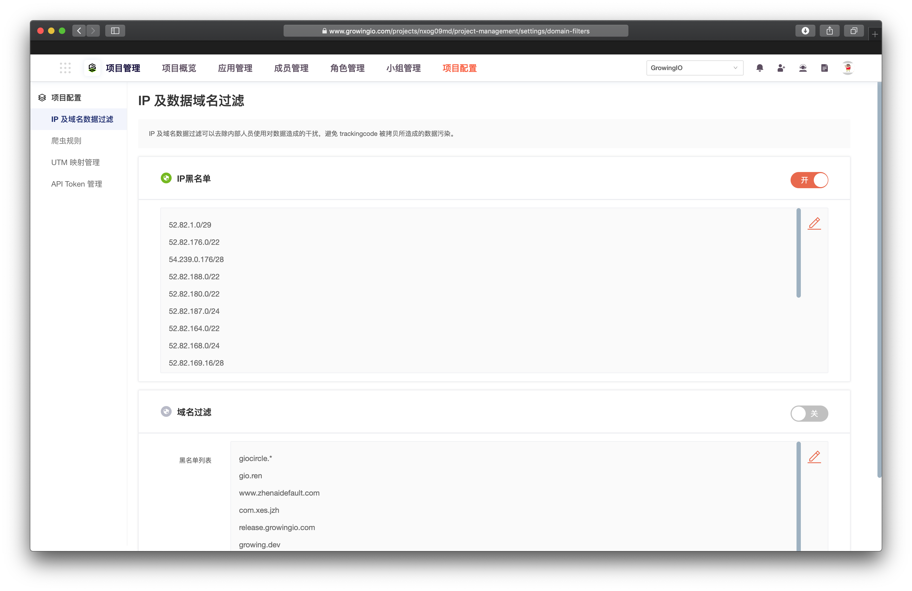
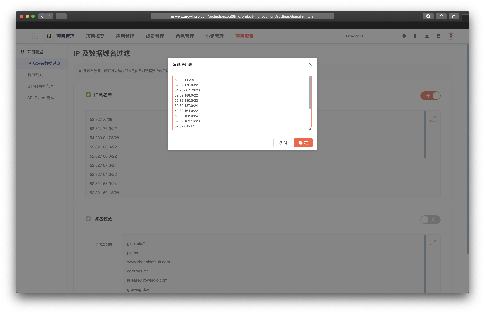

# IP及域名数据过滤

## 用途

IP 及域名数据过滤可以去除内部人员使用对数据造成的干扰，避免 tracking code 被拷贝所造成的数据污染。


IP及域名数据过滤，可能会导致数据与历史产生差异，警慎使用。


## **使用說明**

1. 进入管理页面：   ​点击顶部导航项目配置，打开项目配置界面。选择IP及域名数据过滤页签。

2.添加IP与域名

点击 编辑 按钮， 配置IP黑名单和需要过滤的域名。

3. 开关控制

