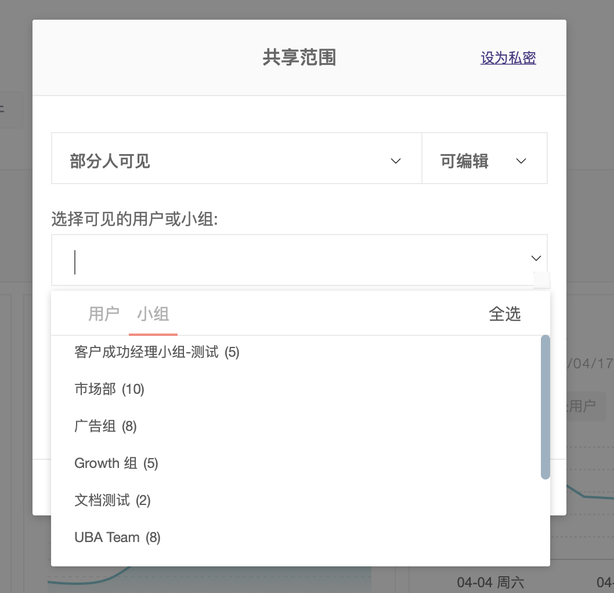
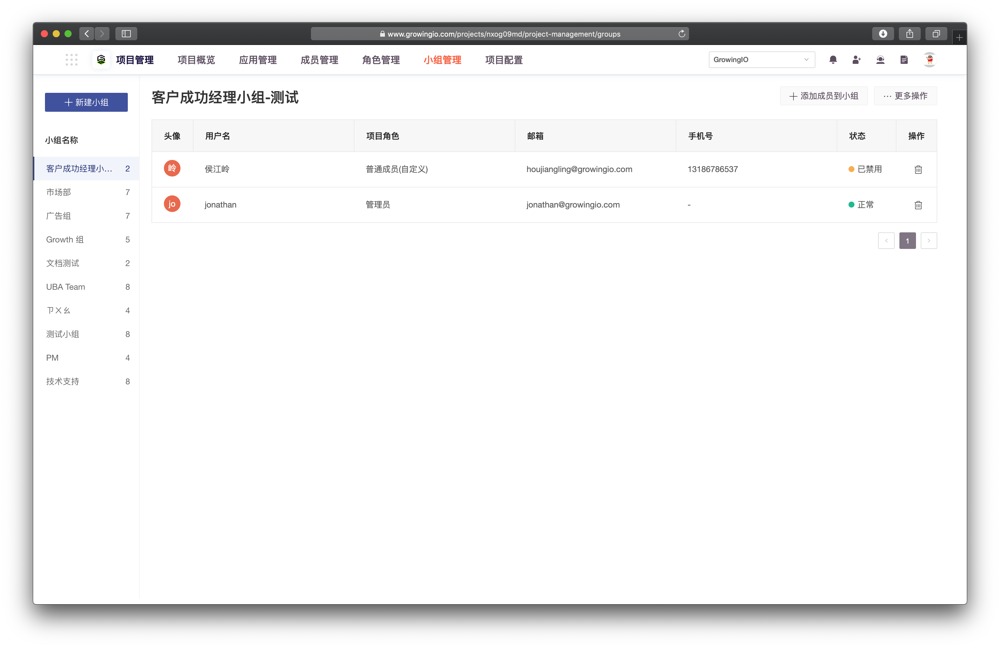
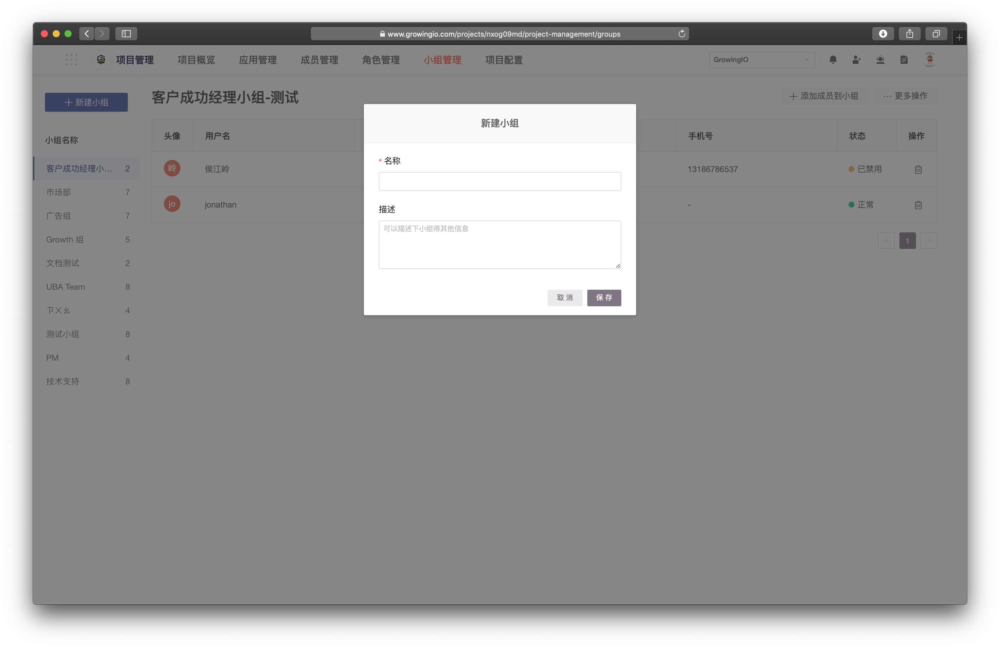
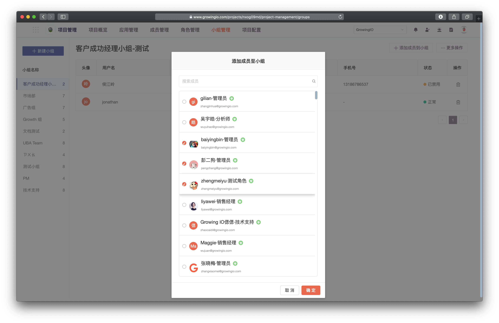

# 小组管理-done

## 用途

将项目成员分组，在生成资源（单图、分群等分享结果）时可选择对小组开放。  
您可以对项目中不同的成员，依据业务的协作需求，成立不同的小组，达到更好的协作。


一个成员 可以同时存在于多个小组之中。


## 进入小组管理

1. 在项目页管理选择 **小组管理** 页签。


透过侧边栏的小组列表，我们可以查看小组内都有哪些成员。


## 新建小组

1. 单击创建小组，输入小组名称、备注。

## 添加成员到小组

1. 点击 **添加成员到小组** 。
2. 完成小组成员配置后单击保存。

