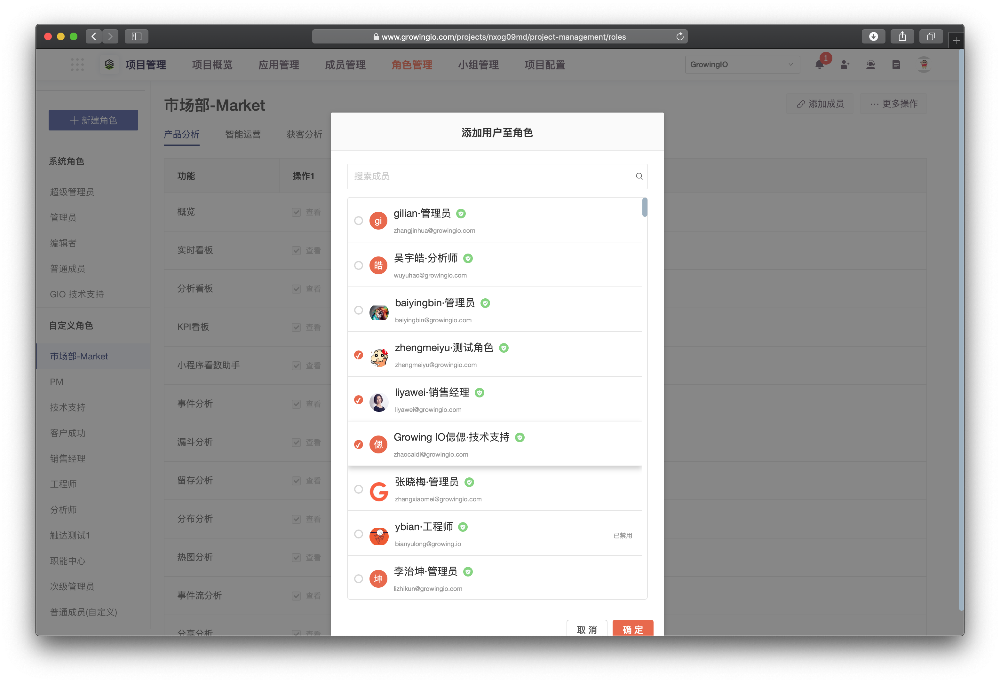
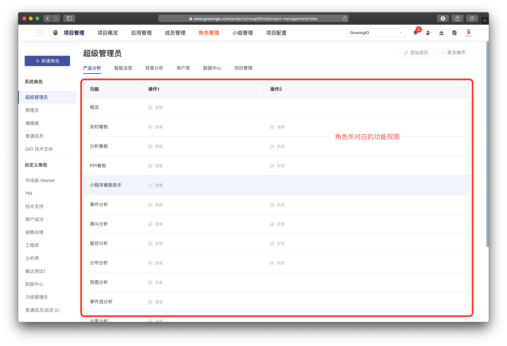
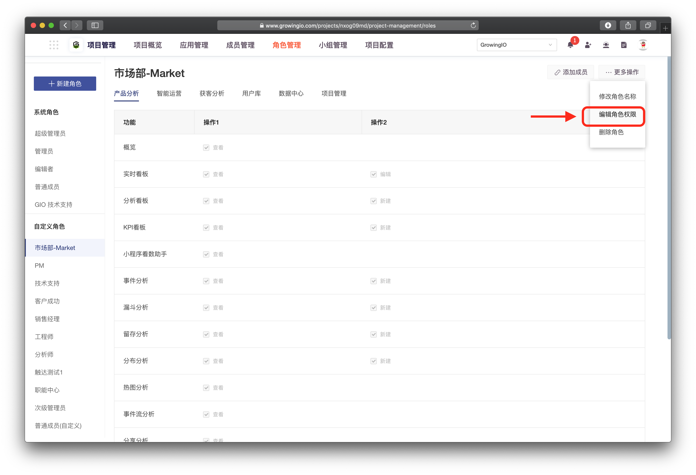
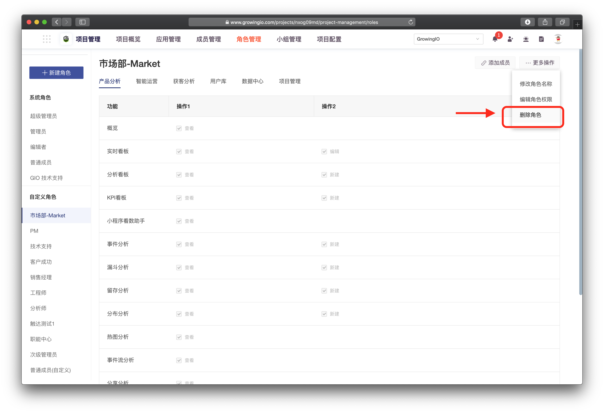

# 角色管理

## 什么**是角色？**

项目中的角色将决定成员在该项目中的功能权限，即该成员可否使用某项功能。GrowingIO 在项目中有预置的 **系统角色**，也支持 **自定义角色。**


每个成员在项目中都会被赋予一个唯一的角色。


## **系统角色**

GrowingIO 在项目中，帮助用户预置了 5 个系统角色：超级管理员、管理员、编辑者、普通成员、GIO技术支持。预置角色不支持编辑角色信息、修改角色权限、删除角色等操作。

#### **超级管理员**

* 超级管理员为项目中拥有最高权限的角色。一般来说是管理者，管理成员们在项目中可以做什么，不能做什么。
* 超级管理员拥有该项目中所有的功能权限（包括更换项目名称、更换超级管理员）和资源权限。

**管理员**

* 管理员可以辅助超级管理员做管理项目的角色。
* 管理员拥有所有功能权限（但不包括更换项目名称、更换超级管理员）。

**编辑者**

* 编辑者是项目中的主要**生产者**，具有功能创建、编辑、查看权限，可将团队内主要负责生产数据看版、数据分析的同事设置为编辑者。

* 编辑者不具有项目中的**管理相关**的权限（成员管理、角色管理、小组管理），无法对其他成员进行管理操作。

**普通成员(阅读者) **

* **普通成员**是项目中的主要**消費者，具有所有功能查看权限，**可将团队内看数据看板的同事设置为**普通成员。**

## **自定义项目角色**

**新建角色：**单击**新建角色**按钮，勾选权限范围，并输入角色名称后进行保存。

**查看角色：**在左侧的角色列表单击选中角色，可查看此角色的功能权限范围。

**編輯角色：**在左侧的角色列表单击选中角色，选择右上角编辑按钮，可修改角色名称、角色功能权限。

**刪除角色：**在左侧的角色列表单击选中角色**，**选择右上角刪除角色按鈕**。  **


1.系统默认角色 不可删除、编辑

2.当角色关联成员时，无法删除角色，请先将成员更换角色后再删除该角色。


## 添加用户至角色&#x20;

您可以赋予成员一个唯一的角色，决定该成员在项目中可以使用哪些功能，从而实现更好的分工协作与管理。

1. 在左侧的角色列表单击选中角色。
2. 在右上方，单击 **添加用户。**
3. 在列表中选择成员。
4. 保存后，即可将成员关联到此角色。

## 查看角色权限

## 編輯角色权限

点击编辑角色 >  进入编辑状态 >  勾选角色功能 。

## 删除角色

点击更多操作 > 点击删除 。

