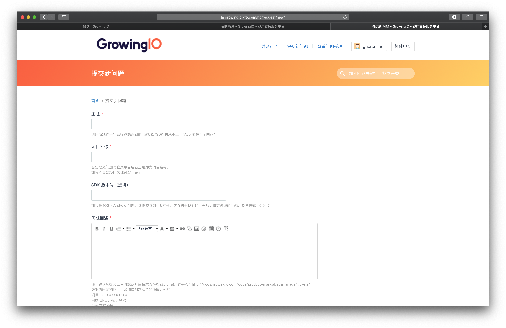

# 提交工单

## 操作步骤

1. 登录GrowingIO平台。
2. 单击界面右上角的 .png>) 选择**提交问题**直接进入工单系统提交新问题界面，
3. 填写工单，并单击**提交。**

****

****

| **参数** | 说明 |
| ------ | -- |

| 主题 | 请用简短的一句话描述您遇到的问题, 如"SDK 集成不上", "App 唤醒不了圈选" |
| -- | ------------------------------------------- |

| 问题类型 | 
-

使用问题

技术问题
 |
| ---- | ------------------------------ |

| 项目名称 | 当您提交问题时登录平台后右上角即为项目名称。 如果不清楚项目名称可写『无』 |
| ---- | ------------------------------------- |

| 问题描述 | 
详细的问题描述，可以加快问题解决的速度。

例如：
<ul><li>项目 ID：XXXXXXXXX</li><li>网站 URL / App 名称：</li><li>App 下载地址：</li><li>疑似数据问题的单图 / 分群名称：</li><li>复现步骤 / 具体描述(截图)：</li><li>崩溃日志（可以附件上传或截图）</li></ul> |
| ---- | -------------------------------------------------------------------------------------------------------------------------------------------------------------------------------------------- |

| 附件上传 | 拖动或点击上传附件。 |
| ---- | ---------- |

## GrowingIO 社区讨论入口

[https://growingio.kf5.com/hc/community/topic/](https://growingio.kf5.com/hc/community/topic/)
