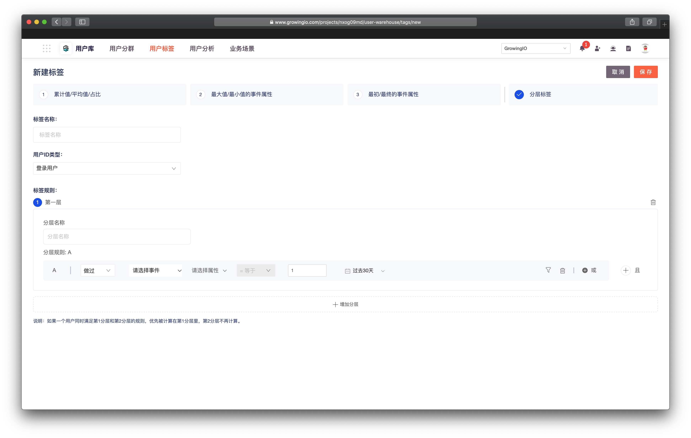

# 分层标签


灰度beta功能 ，如需体验试用，请联系客户经理 。


## 简介

分层标签支持根据自定义规则对用户进行分层打标。


注意：分层标签中，每个用户具有唯一标签值。如一个用户同时满足多个分层规则，则该用户优先被计算在序号最小的分层中。


常见使用场景为：

* 用户活跃度分层
* 用户价值分层 （RFM）
* 用户使用熟练度分层 
* 创作者关注度分层


支持计算规则如下：

分层标签可以依据 用户做过的【事件】， 用户的【属性】 ，用户的 【标签】 ，将用户分为不同层级 。

* 用户做过 
* 用户属性是
* 用户标签是


## 

\*\*\*\*

\*\*\*\*

\*\*\*\*

\*\*\*\*

\*\*\*\*

\*\*\*\*

\*\*\*\*

