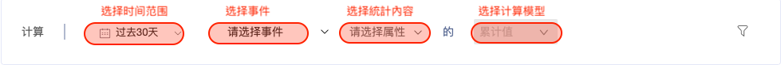
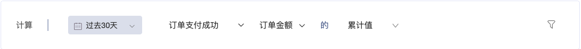
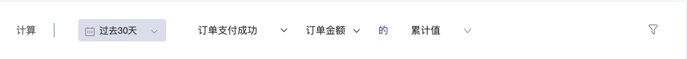
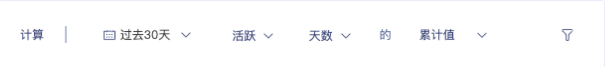
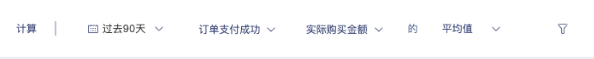
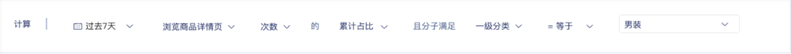

# 基础指标值


灰度beta功能 ，如需体验试用，请联系客户经理 。


## 简介

指标值标签为常用的计算标签模型，用于了解用户对事件的累計、頻率、佔比等表現 ， 统计结果作为标签值，对用户标记。

常见使用场景为：

* 累积消费金额
* 累积消费优惠金額
* 平均消費金额
* 购买自有品牌订单的平均客单价
* 订单金额中自有品牌消费金额占比


支持计算的特征为：

指定周期内，`某个事件`的

* 发生次数
* 使用天数
* 整数、小数事件属性的求和
* 整数、小数事件属性的平均值
* 某个类型事件发生次数占事件总发生次数的占比
* 某个类型事件的整数、小数事件属性求和占该事件整数、小数事件属性总和的占比


## 控件说明

| 项        | 说明                          |
| -------- | --------------------------- |
| 1.选择时间范围 | 如过去7天、过去30天、过去90天等          |
| 2.选择事件   | 如全局指标(访问、活跃)、埋点事件和计算指标      |
| 3.选择統計內容 | 如次数、天数、埋点事件的整数、小数、字符串类型事件属性 |
| 4.选择计算模型 | 如累计值、平均值、占比、去重数             |
| 5.选择事件过滤 | 选择事件过滤条件                    |

由于事件属性的类型不同，支持的计算模型对应关系如下：

| 属性          | 累计值 | 平均值 | 占比 |
| ----------- | --- | --- | -- |
| 次数          | ✔️  |     | ✔️ |
| 天数          | ✔️  |     |    |
| 整数、小数类型事件属性 | ✔️  | ✔️  | ✔️ |

## 常用标签&操作示例

### 示例一：累计值

当一位用戶运营同事，想知道 一位用户 過去30 天一共消費多少錢時，我们可以构建`  累积消费金额  `标签。_這也是 RFM 模型中的 M  。_

如：`过去30天`  `订单支付`  `订单金额`    的  `累计值`

| 项        | 说明      |
| -------- | ------- |
| 1.选择时间范围 | `过去30天` |
| 2.选择事件   | `订单支付`  |
| 3.选择統計內容 | `订单金额`  |
| 4.选择计算模型 | `累计值`   |
| 5.选择事件过滤 |         |

###

### 示例二：累计值

当一位用戶运营同事，想知道 一位用户 過去30 天 活躍多少天時。我们可以构建 `  过去30天活跃天数  `标签。

如： `过去30天`  `活跃`  `天数` 的 `累计值`

| 项        | 说明      |
| -------- | ------- |
| 1.选择时间范围 | `过去30天` |
| 2.选择事件   | `活跃`    |
| 3.选择統計內容 | `天数`    |
| 4.选择计算模型 | `累计值`   |
| 5.选择事件过滤 |         |

###

### 示例三：平均

| 项        | 说明       |
| -------- | -------- |
| 1.选择时间范围 | `过去90天`  |
| 2.选择事件   | `订单支付成功` |
| 3.选择統計內容 | `实际购买金额` |
| 4.选择计算模型 | `平均值`    |
| 5.选择事件过滤 |          |

###

### 示例四：占比

当商品运营人员，为了知道一位用户， 在浏览时对于 男妆品类的兴趣程度 。他需要知道，此用户在所有商品浏览中， 男装占比是多少 。

我們可以構建 `过去7天男装商品浏览次数占总商品浏览次数占比`标签。

| 项        | 说明           |
| -------- | ------------ |
| 1.选择时间范围 | `过去7天`       |
| 2.选择事件   | `浏览商品详情页`    |
| 3.选择属性   | `次数`         |
| 3.选择統計內容 | `累计占比`       |
| 5.占比属性   | `一级分类 等于 男装` |
| 6.选择事件过滤 |              |

