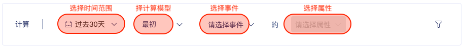
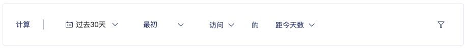

# 最初 / 最终

##  简介

最初/最终的事件属性可以对事件`第一次` / `最后一次`发生的字符串类型事件属性作为标签值，对用户打标。

在业务的语言中，我们会说 用户做一件事 首次／末次的行为特征 。

常见使用场景为：

* 最后一次  购买  的  距今時長
* 最后一次  参与  的  直播课名称
* 最后一次  购买  的  商品类型


支持计算的特征为：

指定周期内，某个事件

* 首次/最后一次   事件发生时的【事件属性】
* 首次/最后一次   事件发生时【距今天数】
* 首次/最后一次   事件发生时的【具体日期】


## 操作说明

| 项 | 说明 |
| :--- | :--- |
| 1.选择时间范围 | 如过去7天、过去30天、过去90天等 |
| 2.选择计算模型 | 如最初、最终 |
| 3.选择事件 | 如全局指标\(访问、活跃\)和埋点事件 |
| 4.选择属性 | 如距今天数、日期和埋点事件的字符串类型事件属性 |
| 5.选择事件过滤 | 选择事件过滤条件 |

## 常用标签&操作示例

### 示例一：销售电话拜访场景

当一位销售人员，为了知道此客户近一年最后一次消费是多久前，且知道最后一次购买的商品 ，以便于对客户进行推销。

因此我们可以构建 

1. 最后一次购买距今多久 的标签：`过去一年`  `最終`  `订单支付成功`    的  `距今天数`    ＝ 23 天

2.  最后一次购买的商品名称  的标签：`过去一年`  `最終`  `订单支付成功`    的  `商品名称`＝  ipad pro 

销售人员 便可知道 该客户在 最后一次消费在 【23天前】 ，购买了【ipad pro】  。

| 项 | 说明 |
| :--- | :--- |
| 1.选择时间范围 | `过去一年` |
| 2.选择计算模型 | `最终` |
| 3.选择事件 | `订单支付成功` |
| 4.选择属性 | `距今天数` /`商品名称` |
| 5.选择事件过滤 |  |

### 

### 示例二：电商品类运营场景

当一个电商平台中，母婴品类的运营人员 ，希望在奶粉快用完时，发优惠券提醒并刺激用户购买奶粉，因此，他想知道 奶粉购买的距今天数 。

`过去90天`  `最終`  `订单支付成功`    的  `距今天数` 

`事件过滤 ：商品品类 ＝ 奶粉`

| 项 | 说明 |
| :--- | :--- |
| 1.选择时间范围 | `过去一年` |
| 2.选择计算模型 | `最终` |
| 3.选择事件 | `订单支付成功` |
| 4.选择属性 | `距今天数` |
| 5.选择事件过滤 | `商品品类 = 奶粉` |


以上为GIO 客户实践的例子 。  
  
真实场景中，类似推荐、预测性质的运营工作，往往会受到很多其他因素的干扰。  
  
但在 早期运营阶段 利用简单的规则标签，便可掌握60%的准确性发挥直接的业务效果 ，當業務流程順暢後再迭代与优化 。

在GIO 的实践经验中 ，标签体系与使用 切忌求大求全，切勿期望一次到位。


### 示例三：用户运营流失招回策略

当一个用户运营，为了招回流失用户，我需要在用户连续3、7、14 天不访问时 ，制定相对应的 招回手段 如 push 、短信等 。

因此，我们可以建立  `最后一次 启动ＡＰＰ 距今天数`     的标签。 

| 项 | 说明 |
| :--- | :--- |
| 1.选择时间范围 | 过去30天 |
| 2.选择计算模型 | 最终 |
| 3.选择事件 | 访问 |
| 4.选择属性 | 距今天数 |
| 5.选择事件过滤 | 平台類型＝ios |


流失用户招回，是用户运营的必要工作 。 

我們可以根據 用戶Ｘ天未訪問，進行多個階段的招回策略。

如 ： 3天 推送提醒 ，7天推送 好友正在看ＸＸ ，14天赠送无限卡 。


