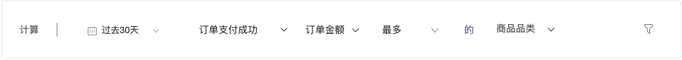

# 最大值 / 最小值


灰度beta功能 ，如需体验试用，请联系客户经理 。


## 简介

常用于了解用户偏好，将事件按照某个事件属性进行分组求和並排序（ 如：`事件-支付订单` 按照 `事件属性 - 商品类型`分組求和並排序），将 第一名 / 最後一名 作为用户标签的值，为每个用户进行标记。

常见使用场景为： &#x20;

* 点赞 `次数`   最多  的  `直播带货主播`
* 收藏 `次数`   最多  的  `商品品类`
* 参与活动 `次数`   最多  的  `A级活动`
* 订单支付 `金额`   最多  的  `商品品类`

计算规则逻辑：

1. 按事件属性分组
2. 对发生次数、整数、小数类型 -- 事件属性求和
3. 將最多、最少的分组属性值作为标签值，对用户打标。


支持计算的特征为：

指定周期内，某个事件的

* 发生次数【最多/最少】的事件属性
* 整数、小数事件属性的求和【最多/最少】的事件属性


## 控件说明

.png>)

| 项          | 说明                    |
| ---------- | --------------------- |
| 1.选择时间范围   | 如过去7天、过去30天、过去90天等    |
| 2.选择事件     | 如全局指标(访问、活跃) 和 埋点事件   |
| 3.选則统计内容   | 如次数和埋点事件的整数、小数类型 事件属性 |
| 4.选择计算模型   | 如最多、最少                |
| 5.选择分組打标属性 | 如埋点事件的字符串类型事件属性       |
| 6.选择事件过滤   | 选择事件过滤条件              |

## 常用标签&操作示例

### 示例一：SaaS 行业电话拜访

当一位GIO的销售同事，为了在首次沟通时能【更好的挖掘客户需求】，他需要知道 一位潜在客户 【需求偏好】。

因此，我们可以 从潜在客户感兴趣的推文文章寻找偏好的可能性 ，构建简单的偏好标签 ，。\
\
如 ： `过去90 天`  `浏览博客文章`  `次数` `最多`  的  `文章分类` 。

如：  `过去90 天`  `功能入口点击`  `次数`  `最多`  的  `功能名称` 。

| 项          | 说明        |
| ---------- | --------- |
| 1.选择时间范围   | `过去90 天`  |
| 2.选择事件     | `功能入口点击`  |
| 3.选則统计内容   | `次数`      |
| 4.选择计算模型   | `最多`      |
| 5.选择分組打标属性 | `功能名称`    |
| 6.选择事件过滤   | 付费状态 = 试用 |


&#x20;以上为GIO 销售运营中 实践的例子 ，看似极为简单的標籤，却能帮助整体潜客转化环节效率大幅提升，售前人员更好的掌握需求沟通方向， 大大提升线索转出效率 30％。

基于不同的业务目标、组织型态、产品阶段 实践的情况都会有所差异 ，标签的使用与业务价值验证， 需要不断的打磨与试验。


### 示例二：社区型内容行业的 兴趣偏好

当运营的同事 ，想了解当前产品用户群体的 内容偏好特征，以便于【话题/活动的运营策划】。

因此我们可以构建以下标签，帮助运营同事 更清晰的洞察用户。

文章偏好：`过去30天`  `浏览文章`   `次数`  `最多`  的  `文章分类`

內容偏好：`过去30天` `点赞/评论`   `次数`  `最多`  的  `话题分类`

创作者偏好：`过去30天` `关注创作者`   `次数`  `最多`  的  `創作者分类`


标签是构建用户画像的基础建设，内容行业为了 更好的贴合用户兴趣，营造社区氛围，构建用户标签是极为重要的数据建设工作 ， 也需要专业的分析师去规划一套成系统的标签系列。

&#x20;以上只作为一个小例子抛砖引玉 ，方便大家快速理解场景与价值 。


### 示例三：电商行业 商品偏好

当一位商品运营同事 ，在做优惠券、商品推广策略时 ，希望对不同的用户可以利用不同的品類優惠券刺激消費。 因此

如：`过去30天`  `订单支付`  `订单金额`  `最多`  的  `商品品类`

如：`过去30天` ` 浏览商品详情頁` `次数`  `最多`  的  `商品品类`

| 项          | 说明      |
| ---------- | ------- |
| 1.选择时间范围   | `过去30天` |
| 2.选择事件     | `订单支付`  |
| 3.选則统计内容   | `订单金额`  |
| 4.选择计算模型   | `最多`    |
| 5.选择分組打标属性 | `商品品类`  |
| 6.选择事件过滤   |         |


经由上方的例子，我们可以发现 ， 偏好标签是构建 千人千面、个性化推荐的基础 ， 以上只作为一个小例子抛砖引玉 ，方便大家快速理解场景与价值 。\
\
在真实的 实践过程中，需要考虑的因素会比示例来的更加复杂。


