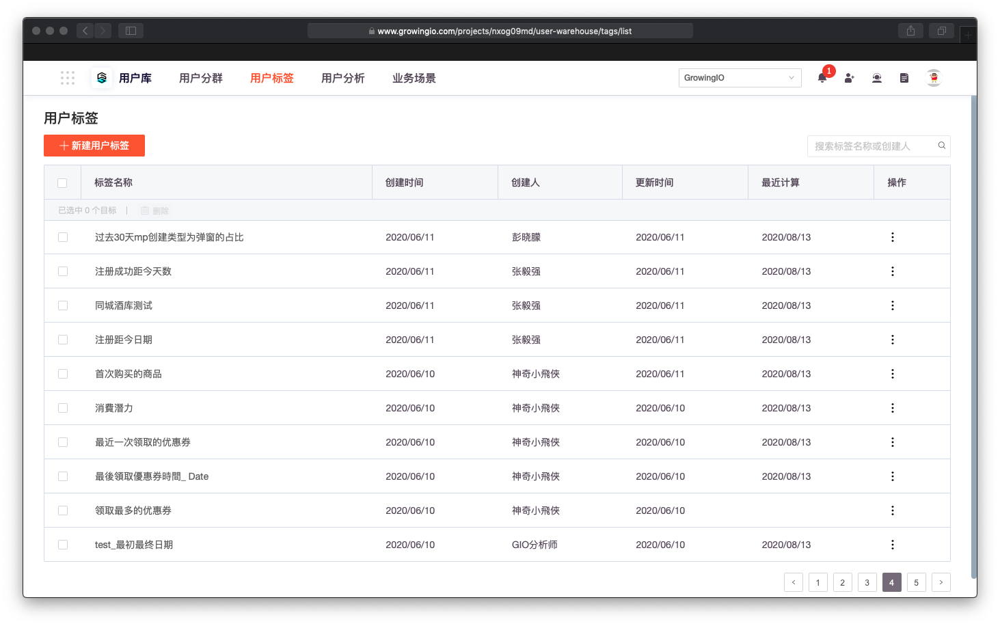
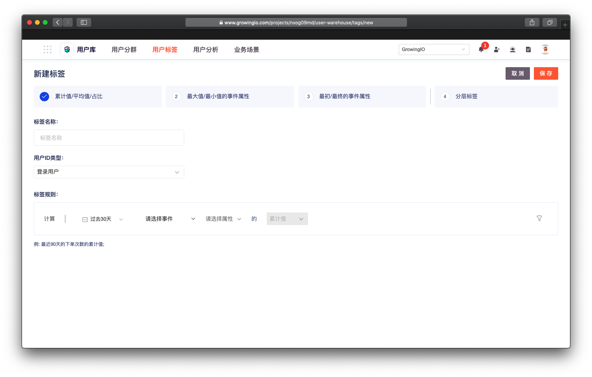

# 创建标签


灰度beta功能 ，如需体验试用，请联系客户经理 。


提供 4 种用户标签的创建方式，您可以根据自己的标签含义，选择相对应的方式进行标签的创建。

不同标签的模型 ，有不同的使用场景 ，详请可见 以下说明： 

* [基础指标值  标签 ](biao-qian-mo-xing-shi-yong/ji-chu-zhi-biao-zhi.md) 
* [最大/ 最小  标签 ](biao-qian-mo-xing-shi-yong/zui-da-zhi-zui-xiao-zhi-de-shi-jian-shu-xing.md)
* [最初 / 最终 标签 ](biao-qian-mo-xing-shi-yong/zui-chu-zui-zhong-de-shi-jian-shu-xing.md)
* [分层标签  ](biao-qian-mo-xing-shi-yong/fen-ceng-biao-qian.md)

## 创建流程：

### 一、在导航栏选择 **"用戶标签 "**，进入标签管理页面。

### 二、单击左上角 "**新建用户标签"**，进入**新建标签**页面。

### 三、选择标签的创建方式 。


目前GrowingIO提供了4种标签计算模型，

分别为

* 累计值/平均值/占比标签
* 最大值/最小值的事件属性标签
* 最初/最终的事件属性标签
* 分层标签

这4种标签主要用于解决 `计算标签`和`规则标签`的使用场景。


### 四、选择打标记的 用户模型 。


GrowingIO  支持对登入用户 /  访问用户 ，两个用户体系分别打标记，在创建标签时请明确标签的 用户体系。

用户体系的差异 ： 请见 [ 用戶模型 ](https://app.gitbook.com/@growingio/s/v3/~/drafts/-MEWSCS5iLxkCJzygg8h/introduction/datamodel/usermodel) 


### 五、开始设置标签规则 。 

不同标签的模型 ，有不同的使用场景 。  
  
详请可见 以下说明 

* [基础指标值  标签 ](biao-qian-mo-xing-shi-yong/ji-chu-zhi-biao-zhi.md)
* [最大/ 最小  标签 ](biao-qian-mo-xing-shi-yong/zui-da-zhi-zui-xiao-zhi-de-shi-jian-shu-xing.md)
* [最初 / 最终 标签 ](biao-qian-mo-xing-shi-yong/zui-chu-zui-zhong-de-shi-jian-shu-xing.md)
* [分层标签  ](biao-qian-mo-xing-shi-yong/fen-ceng-biao-qian.md)

  

